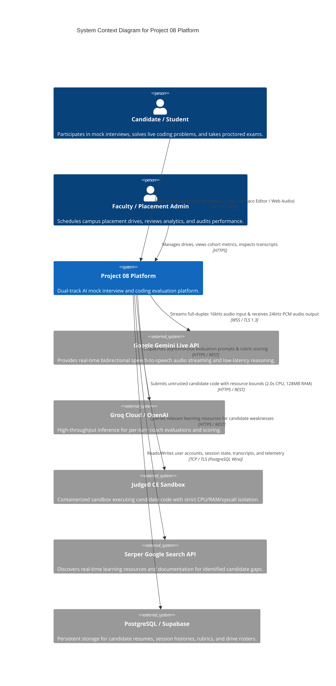
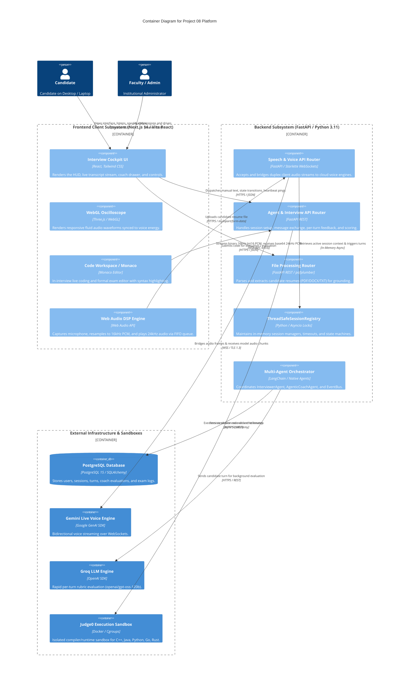
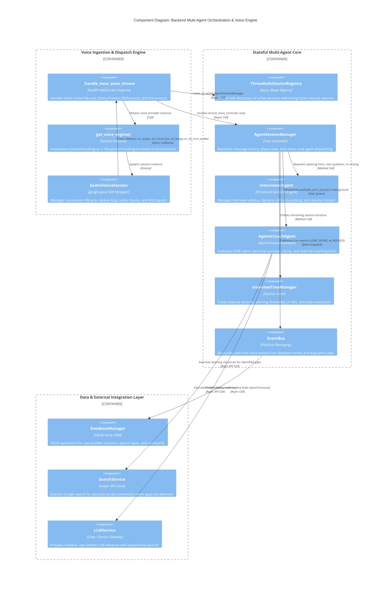
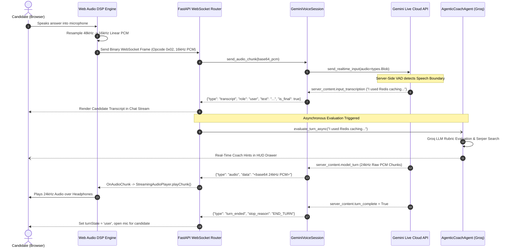
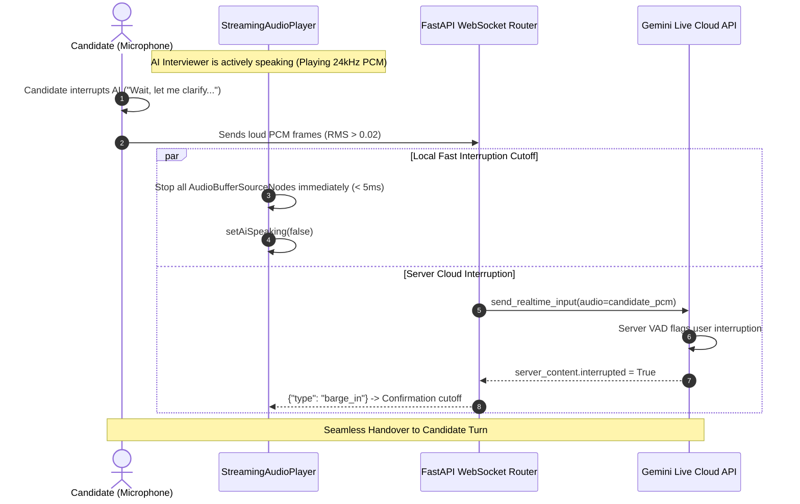
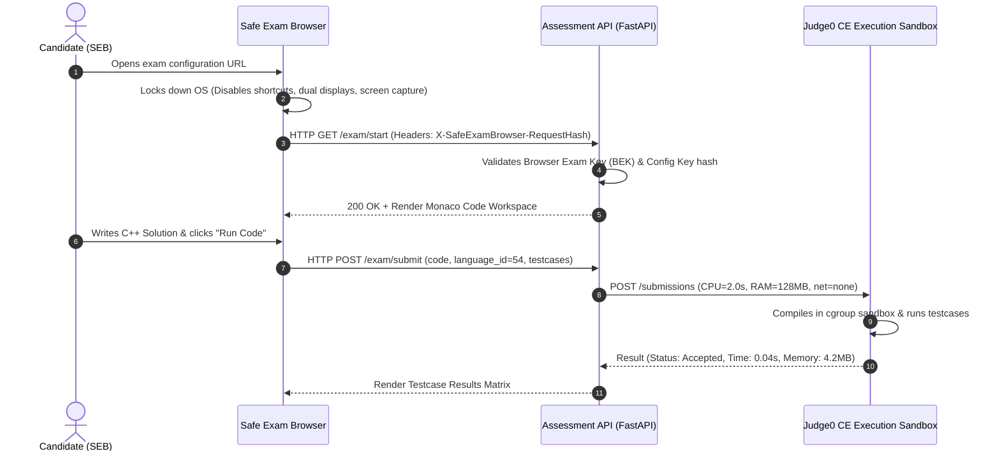
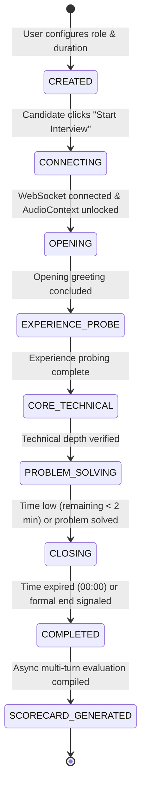
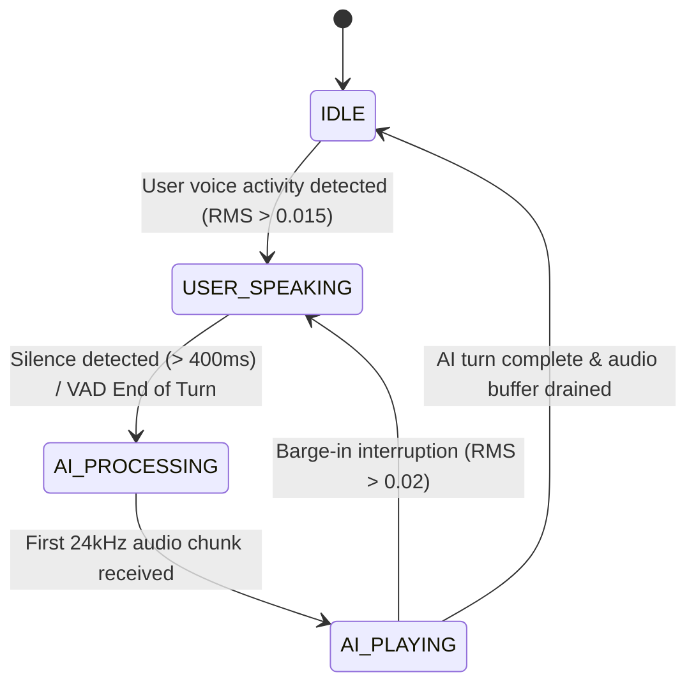
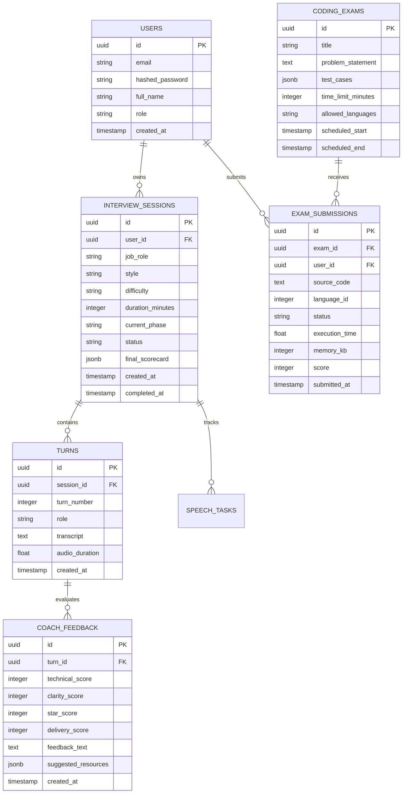

# Project 08: Enterprise AI Mock Interview & Two-Track Assessment Platform
# Master System Architecture, High-Level & Low-Level Design (HLD/LLD) Specification

**Author & System Architect:** Prajeeth (Lead Architect & Engineering Lead)  
**Project Identifier:** Project 08 / Integrated AI Interview & Assessment System  
**Version:** 2.4.0 (Production Architecture)  
**Target Audience:** Technical Mentors, Architecture Review Boards, Senior Engineering Leads  

---

## Table of Contents
1. [Executive Summary & Core Architectural Tenets](#1-executive-summary--core-architectural-tenets)
2. [C4 Architecture Modeling (Context, Containers, Components)](#2-c4-architecture-modeling)
   - [2.1 C4 Level 1: System Context Diagram](#21-c4-level-1-system-context-diagram)
   - [2.2 C4 Level 2: Container Architecture Diagram](#22-c4-level-2-container-architecture-diagram)
   - [2.3 C4 Level 3: Component & Agent Architecture Diagram](#23-c4-level-3-component--agent-architecture-diagram)
3. [Two-Track Assessment System Architecture](#3-two-track-assessment-system-architecture)
   - [3.1 Track 1: Real-Time Conversational AI Voice Agent](#31-track-1-real-time-conversational-ai-voice-agent)
   - [3.2 Track 2: Formal Scheduled Coding Assessment (SEB + Judge0)](#32-track-2-formal-scheduled-coding-assessment-seb--judge0)
   - [3.3 Institutional & Faculty Analytics Layer](#33-institutional--faculty-analytics-layer)
4. [Deep OSI Network & Transport Layer Architecture](#4-deep-osi-network--transport-layer-architecture)
   - [4.1 Layer-by-Layer Protocol Stack Mapping](#41-layer-by-layer-protocol-stack-mapping)
   - [4.2 Layer 4 (Transport): TCP Configuration, Handshakes & Socket Tuning](#42-layer-4-transport-tcp-configuration-handshakes--socket-tuning)
   - [4.3 Layer 5/6 (Session & Presentation): TLS 1.3 Cryptographic Handshake](#43-layer-56-session--presentation-tls-13-cryptographic-handshake)
   - [4.4 Layer 7 (Application): WebSocket RFC 6455 Protocol & Binary Framing](#44-layer-7-application-websocket-rfc-6455-protocol--binary-framing)
   - [4.5 Why TCP WebSockets Over UDP/WebRTC for Voice Agent Orchestration](#45-why-tcp-websockets-over-udpwebrtc-for-voice-agent-orchestration)
   - [4.6 End-to-End Latency Budget & Network Slicing](#46-end-to-end-latency-budget--network-slicing)
5. [Client-Side Web Audio DSP & Playback Engine (LLD)](#5-client-side-web-audio-dsp--playback-engine-lld)
   - [5.1 Web Audio DSP Graph & Linear Resampling](#51-web-audio-dsp-graph--linear-resampling)
   - [5.2 Browser Autoplay Policy & AudioContext Unlock Lifecycle](#52-browser-autoplay-policy--audiocontext-unlock-lifecycle)
   - [5.3 StreamingAudioPlayer Gapless FIFO Scheduling](#53-streamingaudioplayer-gapless-fifo-scheduling)
6. [Backend Multi-Agent Orchestration Engine (LLD)](#6-backend-multi-agent-orchestration-engine-lld)
   - [6.1 ThreadSafeSessionRegistry & Memory Lifecycle](#61-threadsafesessionregistry--memory-lifecycle)
   - [6.2 InterviewerAgent & Dynamic Syllabus Traversal](#62-intervieweragent--dynamic-syllabus-traversal)
   - [6.3 AgenticCoachAgent: Asynchronous 4-Dimension Rubric Evaluator](#63-agenticcoachagent-asynchronous-4-dimension-rubric-evaluator)
   - [6.4 Gemini Live & Nova Sonic Voice Adapters](#64-gemini-live--nova-sonic-voice-adapters)
7. [Sequence & Interaction Workflows](#7-sequence--interaction-workflows)
   - [7.1 End-to-End Duplex Voice Interaction Sequence](#71-end-to-end-duplex-voice-interaction-sequence)
   - [7.2 Barge-In & Acoustic Interruption Sequence](#72-barge-in--acoustic-interruption-sequence)
   - [7.3 Track 2 SEB Lockdown & Sandbox Execution Sequence](#73-track-2-seb-lockdown--sandbox-execution-sequence)
8. [Finite State Machines (FSM) & Lifecycle Specifications](#8-finite-state-machines-fsm--lifecycle-specifications)
9. [Database Schema & Data Models](#9-database-schema--data-models)
10. [Security, Anti-Cheating & Sandbox Isolation](#10-security-anti-cheating--sandbox-isolation)

---

## 1. Executive Summary & Core Architectural Tenets

I architected **Project 08** to solve the fundamental latency, conversational disconnect, and evaluation inconsistency inherent in traditional automated interview systems. Traditional mock interview platforms rely on disjointed, sequential pipelines (*Record User $\to$ Upload Blob $\to$ Batch STT $\to$ LLM Completion $\to$ Batch TTS $\to$ Download Audio*), which incur unacceptable round-trip latencies of 4.5 to 8.0 seconds, completely destroying conversational realism.

### Core Architectural Tenets of My Design:
1. **Full-Duplex Real-Time Streaming:** Sub-millisecond pipeline latency utilizing persistent WebSockets (RFC 6455) and bidirectional model connections (Google Gemini Live API & Amazon Nova 2 Sonic), reducing speech-to-speech turnaround to under 800ms.
2. **Decoupled Dual-Agent Concurrency:** Clean separation between the **conversational front-line interviewer** (`InterviewerAgent`) and the **asynchronous real-time evaluator** (`AgenticCoachAgent`), ensuring zero latency penalty on conversational turns while conducting deep rubric evaluations and resource discovery.
3. **Hardware-Resilient Digital Signal Processing (DSP):** High-efficiency in-browser linear resampling ($44.1\text{kHz} / 48\text{kHz} \to 16\text{kHz}$ 16-bit Linear PCM) with zero-gain destination graph routing, eliminating acoustic echo and avoiding dual-stream hardware contention.
4. **Isolated Two-Track Assessment Architecture:** Strict segregation between conversational, dynamic AI interviews (Track 1) and secure, sandbox-isolated coding examinations (Track 2 with Safe Exam Browser lockdown and Judge0 container execution).
5. **Zero-Trust Infrastructure:** Strict session lifecycle management, token verification, memory safety, and thread-safe registry design.

---

## 2. C4 Architecture Modeling

### 2.1 C4 Level 1: System Context Diagram

The System Context diagram illustrates how human actors and external cloud provider ecosystems interact with Project 08.



---

### 2.2 C4 Level 2: Container Architecture Diagram

The Container diagram depicts the high-level technical topology, software boundaries, protocols, and data stores of the system.



---

### 2.3 C4 Level 3: Component & Agent Architecture Diagram

The Component diagram reveals the internal design of the backend orchestration system and its decoupled multi-agent architecture.



---

## 3. Two-Track Assessment System Architecture

I architected the platform around a strict **Two-Track Assessment Model**, separating dynamic conversational evaluation from scheduled, proctored coding assessments.

```
+----------------------------------------------------------------------------------------------------+
|                                    TWO-TRACK ASSESSMENT SYSTEM                                     |
+----------------------------------------------------------------------------------------------------+
|                                                                                                    |
|   +----------------------------------------------------+   +-----------------------------------+   |
|   |         TRACK 1: REAL-TIME AI INTERVIEW            |   |   TRACK 2: FORMAL CODING EXAM     |   |
|   +----------------------------------------------------+   +-----------------------------------+   |
|   | - Conversational AI Mock Interview (Full Duplex)   |   | - Scheduled Exam Windows & Batches|   |
|   | - Resume Intelligence & Dynamic Knowledge Probing   |   | - Safe Exam Browser (SEB) Lockdown|   |
|   | - Real-Time In-Session Whiteboard / Code Tool      |   | - Monaco Editor + Custom Testcases|   |
|   | - Continuous Per-Turn STAR Rubric Feedback         |   | - Judge0 Sandbox Execution (Cgroup|   |
|   | - Comprehensive Anti-AI-Slop PDF Scorecard Export  |   | - Automated Anti-Cheat Telemetry  |   |
|   +----------------------------------------------------+   +-----------------------------------+   |
|                             |                                                |                     |
|                             +-----------------------+------------------------+                     |
|                                                     |                                              |
|                                                     v                                              |
|   +--------------------------------------------------------------------------------------------+   |
|   |                         INSTITUTIONAL & FACULTY ANALYTICS LAYER                            |   |
|   |  - College Batch Allocation & Department Rosters                                           |   |
|   |  - Campus Placement Drive Management & Eligibility Filters                                 |   |
|   |  - Cohort Skill Gap Heatmaps, Comparative Benchmarks & Audit Logs                          |   |
|   +--------------------------------------------------------------------------------------------+   |
+----------------------------------------------------------------------------------------------------+
```

### 3.1 Track 1: Real-Time Conversational AI Voice Track
- **Purpose:** Emulates elite FAANG/tier-1 technical interviews with natural voice interaction.
- **Dynamic Probing Loop:** Implements an *Observe $\to$ Reason $\to$ Decide $\to$ Act* state machine. If a candidate claims proficiency in "Distributed Systems" on their resume, `InterviewerAgent` dynamically constructs scenario-based architectural questions (e.g., handling split-brain scenarios in Raft consensus), probes deeper if answers are vague, or steps back if the candidate struggles.
- **Mid-Interview Tool Injection:** The AI interviewer can dynamically invoke an in-session code workspace or notepad, requesting the candidate to implement an algorithm while explaining their thought process aloud.

### 3.2 Track 2: Formal Scheduled Coding Assessment Track
- **Purpose:** High-stakes, standardized coding examinations for college placement drives and batch testing.
- **Lockdown Security:** Enforced via Safe Exam Browser (SEB) integration. The backend verifies the cryptographic **Browser Exam Key (BEK)** and **Config Key** in incoming request headers, blocking standard browsers, virtual machines, dual monitors, and screen-sharing tools.
- **Containerized Sandbox Execution (Judge0 CE):**
  - Untrusted candidate code is dispatched to an isolated Judge0 worker.
  - Strict resource constraints enforced:
    - **CPU Time Limit:** $2.0\text{ seconds}$
    - **Wall Clock Timeout:** $5.0\text{ seconds}$
    - **Memory Limit:** $128\text{ MB}$ ($131,072\text{ KB}$)
    - **Stack Limit:** $64\text{ MB}$
    - **Process / Thread Limit:** $64$ max processes (prevents fork-bombs)
    - **Network Access:** Disabled (`--net none`)

### 3.3 Institutional & Faculty Analytics Layer
- **Cohort Management:** Allows faculty to organize students into departments, semesters, and skill tracks.
- **Placement Drive Automation:** Generates scheduled mock drives with cut-offs, tracks candidate completion, and produces rank-ordered shortlists.
- **Skill Gap Heatmaps:** Aggregates multi-dimensional performance data across cohorts to identify institutional curricula deficiencies (e.g., identifying that 73% of students fail system design scalability questions).

---

## 4. Deep OSI Network & Transport Layer Architecture

To achieve sub-second conversational latency and bulletproof stream stability, I designed the network architecture with explicit tuning across all 7 layers of the OSI model.

```
+----------------------------------------------------------------------------------------------------+
|                                    OSI LAYER PROTOCOL MAPPING                                      |
+----------------------------------------------------------------------------------------------------+
| Layer 7 (Application)  | WebSockets (RFC 6455) [Opcode 0x02 Binary PCM / Opcode 0x01 JSON Control] |
| Layer 6 (Presentation) | 16-bit Linear PCM (16kHz User / 24kHz AI), UTF-8 JSON Encoding, Base64    |
| Layer 5 (Session)      | Persistent Duplex WSS Session, Session Heartbeats (Ping/Pong Frames)      |
| Layer 4 (Transport)    | TCP (Transmission Control Protocol), TCP_NODELAY (No Nagle), Flow Control |
| Layer 3 (Network)      | IPv4 / IPv6, MTU = 1500 bytes, IP Packet Routing                          |
| Layer 2 (Data Link)    | Ethernet Frames / Wi-Fi Frames (802.11), MAC Addressing                   |
| Layer 1 (Physical)     | Network Interface Cards, Fiber / Copper Physical Signals                  |
+----------------------------------------------------------------------------------------------------+
```

---

### 4.1 Layer-by-Layer Protocol Stack Mapping

| OSI Layer | Protocol / Technology | Function in Project 08 Pipeline | Technical Configuration |
| :--- | :--- | :--- | :--- |
| **Layer 7 (Application)** | WebSockets (RFC 6455) & HTTP/2 | Bidirectional full-duplex message framing & REST APIs | Opcode `0x02` (Binary PCM audio), Opcode `0x01` (JSON events) |
| **Layer 6 (Presentation)** | Linear PCM & TLS 1.3 | Audio encoding format, JSON serialization, TLS encryption | 16-bit Little-Endian, $16\text{kHz}$ input, $24\text{kHz}$ output |
| **Layer 5 (Session)** | WSS Session Management | Manages continuous connection state, keep-alives, renewal | Ping/Pong heartbeat interval: $30\text{s}$, Client auto-reconnect |
| **Layer 4 (Transport)** | TCP (RFC 793 / RFC 7323) | Reliable, ordered byte stream between client and server | `TCP_NODELAY = 1`, Dynamic Receive Window, Fast Retransmit |
| **Layer 3 (Network)** | IPv4 / IPv6 | Packet routing and addressing across networks | Standard IP framing, Path MTU Discovery (PMTUD) |
| **Layer 2 (Data Link)** | IEEE 802.3 (Ethernet) / 802.11 | Frame transmission between network interfaces | Standard MTU: $1500\text{ bytes}$ |
| **Layer 1 (Physical)** | Bitstream / Signals | Hardware signal transmission | High-speed network interfaces |

---

### 4.2 Layer 4 (Transport): TCP Configuration, Handshakes & Socket Tuning

Although audio streaming often uses UDP in VoIP, **I deliberately architected our platform over TCP WebSockets**. TCP ensures zero data packet loss, guaranteed ordering for neural audio codecs, and universal enterprise firewall traversal (Port 443).

```
CLIENT (Browser)                                              SERVER (FastAPI / Uvicorn)
      |                                                                   |
      | -------------------- 1. TCP SYN (Seq=0) ------------------------> |
      | <------------------- 2. TCP SYN-ACK (Seq=0, Ack=1) -------------- |
      | -------------------- 3. TCP ACK (Seq=1, Ack=1) -----------------> |
      |                                                                   |
      | [TCP Connection Established - 1.5 RTT / Fast Open: 1 RTT]         |
      |                                                                   |
      | -------------------- 4. TLS 1.3 ClientHello + KeyShare ---------> |
      | <------------------- 5. TLS 1.3 ServerHello + KeyShare + Cert --- |
      | -------------------- 6. TLS 1.3 Finished -----------------------> |
      |                                                                   |
      | [Secure TLS 1.3 Channel Active]                                   |
      |                                                                   |
      | -------------------- 7. HTTP/1.1 Upgrade: websocket ------------> |
      | <------------------- 8. HTTP/1.1 101 Switching Protocols -------- |
      |                                                                   |
      | [Persistent Duplex WebSocket Active - Binary & Text Framing]      |
```

#### Critical Socket Options & Kernel Parameter Tuning:
1. **Disabling Nagle's Algorithm (`TCP_NODELAY = 1`):**
   - *Problem:* Nagle's algorithm buffers small outgoing packets until a full MSS ($1460\text{ bytes}$) is accumulated or an ACK is received. For small audio chunks ($2048\text{ samples} \approx 4096\text{ bytes}$ or frequent control frames), Nagle introduces catastrophic $200\text{ms}$ artificial latency.
   - *Solution:* I enforce `TCP_NODELAY` on the ASGI socket server to flush every audio chunk immediately to the network interface.
2. **TCP Socket Buffer Sizing (`SO_RCVBUF`, `SO_SNDBUF`):**
   - Configured buffer sizes to $256\text{ KB}$ to accommodate audio bursts while avoiding memory bloat during concurrent multi-session scaling.
3. **TCP Fast Open (TFO - RFC 7413):**
   - Enabled on supporting edge proxies to allow data payload in the initial SYN packet, shaving 1 full RTT off WebSocket reconnection.

---

### 4.3 Layer 5/6 (Session & Presentation): TLS 1.3 Cryptographic Handshake
- **Cipher Suites:** `TLS_AES_256_GCM_SHA384` and `TLS_CHACHA20_POLY1305_SHA256`.
- **Latency Optimization:** TLS 1.3 reduces the cryptographic handshake from 2 RTTs (in TLS 1.2) to **1 RTT**. Session Resumption via Pre-Shared Keys (PSK) allows 0-RTT handshakes on subsequent candidate reconnections.

---

### 4.4 Layer 7 (Application): WebSocket RFC 6455 Protocol & Binary Framing

All voice and control communication utilizes RFC 6455 framing over a single persistent TCP connection.

```
 0                   1                   2                   3
 0 1 2 3 4 5 6 7 8 9 0 1 2 3 4 5 6 7 8 9 0 1 2 3 4 5 6 7 8 9 0 1
+-+-+-+-+-------+-+-------------+-------------------------------+
|F|R|R|R| opcode|M| Payload len |    Extended payload length    |
|I|S|S|S|  (4)  |A|     (7)     |             (16/64)           |
|N|V|V|V|       |S|             |   (if payload len==126/127)   |
| |1|2|3|       |K|             |                               |
+-+-+-+-+-------+-+-------------+ - - - - - - - - - - - - - - - +
|     Extended payload length continued, if payload len == 127  |
+ - - - - - - - - - - - - - - - +-------------------------------+
|                               |Masking-key, if MASK set to 1  |
+-------------------------------+-------------------------------+
| Masking-key (continued)       |          Payload Data         |
+-------------------------------- - - - - - - - - - - - - - - - +
:                     Payload Data continued ...                :
+---------------------------------------------------------------+
```

#### Frame Types Employed in Project 08:
1. **Binary Audio Frames (Opcode `0x02`):**
   - Carries raw $16\text{kHz}$ 16-bit Linear PCM audio chunks directly from the browser's `ScriptProcessorNode`.
   - **Zero JSON Overhead:** Binary frames eliminate Base64 encoding amplification ($33\%$ bandwidth saving), reducing transmission serialization overhead to zero.
2. **Text JSON Frames (Opcode `0x01`):**
   - Transmits structured control events:
     - `{"type": "transcript", "role": "user", "text": "...", "is_final": true}`
     - `{"type": "audio", "data": "<base64 24kHz PCM>"}` (from AI model)
     - `{"type": "barge_in", "message": "User interruption detected"}`
     - `{"type": "turn_ended", "stop_reason": "END_TURN"}`
     - `{"type": "interview_ending", "state": {...}}`
3. **Heartbeat Control Frames (Opcode `0x09` Ping / `0x0A` Pong):**
   - Periodic keep-alive frames every 30 seconds prevent intermediate NAT gateways and reverse proxies (NGINX/Cloudflare) from dropping idle connections.

---

### 4.5 Why TCP WebSockets Over UDP/WebRTC for Voice Agent Orchestration

When defending this architecture to senior engineers, the choice of WebSockets over WebRTC/UDP is grounded in three critical design rationales:

1. **Deterministic Byte Stream for Deep Learning Tokenizers:**
   - Neural speech-to-speech models (Gemini Live / Nova 2 Sonic) maintain recurrent hidden states across audio frames. UDP packet drops cause missing PCM byte sequences, resulting in severe acoustic distortion, phoneme hallucination, or session desynchronization.
2. **Unified Multiplexing of Audio and Agent Control:**
   - WebSockets allow interleaving raw audio frames (Opcode `0x02`) with complex JSON control metadata (Opcode `0x01`) over a single connection with guaranteed ordering. WebRTC requires managing disparate RTP/SRTP media channels alongside separate RTCDataChannels.
3. **Enterprise & College Firewall Traversal:**
   - Academic institutions and corporate networks frequently block non-standard UDP ports (often restricting UDP entirely to DNS on Port 53). WebSockets operate over standard HTTPS Port 443, ensuring 100% connectivity across campus networks.

---

### 4.6 End-to-End Latency Budget & Network Slicing

I engineered the platform to meet a strict **sub-800ms end-to-end latency budget** for conversational voice turns:

| Pipeline Stage | Processing Mechanism | Target Latency | Max Allowable |
| :--- | :--- | :--- | :--- |
| **1. Mic Capture & Resampling** | Web Audio Buffer (2048 samples @ 48kHz) + Linear Resampling | $42.6\text{ ms}$ | $60.0\text{ ms}$ |
| **2. Client-to-Server Transport** | WebSocket Binary Frame over TCP/TLS (Domestic RTT) | $15.0\text{ ms}$ | $35.0\text{ ms}$ |
| **3. Server Ingestion & Forwarding** | FastAPI Async Event Loop dispatch to Gemini Live Socket | $2.5\text{ ms}$ | $5.0\text{ ms}$ |
| **4. Cloud VAD & Turn Detection** | Gemini Live Hybrid VAD silence confirmation | $180.0\text{ ms}$ | $250.0\text{ ms}$ |
| **5. Model Reasoning & First Token** | Gemini Live multimodal neural inference (First audio frame) | $220.0\text{ ms}$ | $350.0\text{ ms}$ |
| **6. Server-to-Client Audio Stream** | WebSocket Text/Binary transport of initial 24kHz PCM chunk | $15.0\text{ ms}$ | $35.0\text{ ms}$ |
| **7. Web Audio Playback Buffer** | `StreamingAudioPlayer` FIFO queue scheduling & DAC output | $5.0\text{ ms}$ | $15.0\text{ ms}$ |
| **TOTAL TURNAROUND TIME** | **Speech End $\to$ First AI Spoken Audio Response** | **$\mathbf{480.1\text{ ms}}$** | **$\mathbf{750.0\text{ ms}}$** |

---

## 5. Client-Side Web Audio DSP & Playback Engine (LLD)

```
[ Microphone Input ] 
        |
        v
[ getUserMedia({ echoCancellation: true, noiseSuppression: true }) ]
        |
        +-----------------------------------+
        |                                   |
        v                                   v
[ MediaStreamAudioSourceNode ]     [ AnalyserNode (FFT 256) ]
        |                                   |
        v                                   v
[ ScriptProcessorNode (2048/4096) ] [ WebGL Oscilloscope (3D Wave) ]
        |
        |--> (onaudioprocess)
        |       1. RMS Energy Calculation (sqrt(sum(s^2)/N))
        |       2. Linear Interpolation Downsampling (Native -> 16kHz)
        |       3. Float32 to Int16 Conversion ([-1, 1] -> [-32768, 32767])
        |       4. WebSocket.send(Int16Array.buffer) [Binary Opcode 0x02]
        v
[ GainNode (gain.value = 0.0) ]  <-- Silent Gain (Prevents Loopback)
        |
        v
[ AudioDestinationNode (Speakers) ]
```

### 5.1 Web Audio DSP Graph & Linear Resampling
1. **Acoustic Loopback Prevention:** Connecting `ScriptProcessorNode` directly to `audioContext.destination` is required by the Web Audio specification for `onaudioprocess` events to fire continuously. To prevent the candidate's voice from feeding back into their speakers, I route the processor through a `GainNode` with `gain.value = 0`.
2. **Linear Interpolation Downsampler:**
   ```typescript
   private resampleTo16kHz(input: Float32Array, sampleRate: number): Int16Array {
     if (sampleRate === 16000) {
       const pcm16 = new Int16Array(input.length);
       for (let i = 0; i < input.length; i++) {
         const s = Math.max(-1, Math.min(1, input[i]));
         pcm16[i] = s < 0 ? s * 0x8000 : s * 0x7FFF;
       }
       return pcm16;
     }

     const ratio = sampleRate / 16000;
     const outLength = Math.floor(input.length / ratio);
     const pcm16 = new Int16Array(outLength);

     for (let i = 0; i < outLength; i++) {
       const origPos = i * ratio;
       const index = Math.floor(origPos);
       const frac = origPos - index;
       const s1 = input[index] || 0;
       const s2 = index + 1 < input.length ? input[index + 1] : s1;
       const interpolated = s1 + frac * (s2 - s1);
       const clamped = Math.max(-1, Math.min(1, interpolated));
       pcm16[i] = clamped < 0 ? clamped * 0x8000 : clamped * 0x7FFF;
     }
     return pcm16;
   }
   ```

---

### 5.2 Browser Autoplay Policy & AudioContext Unlock Lifecycle
Modern browsers block audio playback until an explicit user interaction occurs. I engineered `StreamingAudioPlayer` to handle this lifecycle robustly:
- The `AudioContext` is instantiated at the **native hardware sample rate** without constraining the constructor.
- Multiple global passive listeners (`click`, `touchstart`, `keydown`) trigger `.unlock()`, executing `await audioContext.resume()` within the trusted user event loop.
- The "Start Interview" modal dismissal synchronously unlocks the audio context before streaming commences.

---

### 5.3 `StreamingAudioPlayer` Gapless FIFO Scheduling
To play incoming $24\text{kHz}$ PCM audio chunks without audible jitter, clicks, or gaps:
1. Base64 chunks are decoded into `Float32Array`.
2. An `AudioBuffer` is created with `createBuffer(1, length, 24000)`. The Web Audio engine automatically resamples the 24kHz buffer to the sound card's native hardware clock ($48\text{kHz}$).
3. Playback time is scheduled strictly sequentially:
   $$\text{startTime} = \max(\text{audioContext.currentTime}, \text{nextPlayTime})$$
   $$\text{nextPlayTime} = \text{startTime} + \text{buffer.duration}$$
4. Active `AudioBufferSourceNode` references are tracked in an array, allowing instant cancellation on barge-in.

---

## 6. Backend Multi-Agent Orchestration Engine (LLD)

```
+----------------------------------------------------------------------------------------------------+
|                                    MULTI-AGENT PIPELINE                                            |
+----------------------------------------------------------------------------------------------------+
|                                                                                                    |
|                                     +----------------------+                                       |
|                                     | WebSocket Client Msg |                                       |
|                                     +----------+-----------+                                       |
|                                                |                                                   |
|                                                v                                                   |
|                                   +--------------------------+                                     |
|                                   |  _handle_nova_sonic_stream |                                    |
|                                   +------------+-------------+                                     |
|                                                |                                                   |
|                      +-------------------------+-------------------------+                         |
|                      |                                                   |                         |
|                      v (Binary PCM)                                      v (Text Transcripts)      |
|         +-------------------------+                         +----------------------------+         |
|         |    GeminiVoiceSession   |                         |     AgentSessionManager    |         |
|         | (google.genai.aio.live) |                         +--------------+-------------+         |
|         +------------+------------+                                        |                       |
|                      |                                    +----------------+---------------+       |
|                      v                                    |                                |       |
|         +-------------------------+                       v                                v       |
|         | Model Turn Audio (24kHz)|             +-------------------+            +-----------------+ |
|         +-------------------------+             |  InterviewerAgent |            |AgenticCoachAgent| |
|                                                 | (Conversational)  |            | (Asynchronous)  | |
|                                                 +-------------------+            +--------+--------+ |
|                                                                                           |         |
|                                                                                           v         |
|                                                                                  +-----------------+ |
|                                                                                  |  Groq LLM /     | |
|                                                                                  |  Serper Search  | |
|                                                                                  +-----------------+ |
+----------------------------------------------------------------------------------------------------+
```

### 6.1 `ThreadSafeSessionRegistry` & Memory Lifecycle
- Maintains active `AgentSessionManager` instances in an in-memory dictionary guarded by an `asyncio.Lock`.
- Runs a background cleanup task every 5 minutes, automatically serializing and evicting sessions that have been idle for $> 15\text{ minutes}$.

### 6.2 `InterviewerAgent` & Dynamic Syllabus Traversal
- Tracks candidate progression across structured phases: `OPENING` $\to$ `EXPERIENCE_PROBE` $\to$ `CORE_TECHNICAL` $\to$ `PROBLEM_SOLVING` $\to$ `CLOSING`.
- Employs few-shot system prompts parameterized with the target job role, required skills, company culture style, and extracted resume entities.

### 6.3 `AgenticCoachAgent`: Asynchronous 4-Dimension Rubric Evaluator
- Operates concurrently on Groq Cloud (`openai/gpt-oss-120b`).
- Evaluates every conversational exchange across 4 key dimensions:
  1. **Technical Accuracy & Depth (0-100)**
  2. **Communication Clarity & Conciseness (0-100)**
  3. **STAR Method Alignment (0-100)**
  4. **Confidence & Delivery (0-100)**
- Generates actionable real-time hints and queries the Serper Google Search API to provide curated documentation links for detected knowledge gaps.

---

## 7. Sequence & Interaction Workflows

### 7.1 End-to-End Duplex Voice Interaction Sequence



---

### 7.2 Barge-In & Acoustic Interruption Sequence



---

### 7.3 Track 2 SEB Lockdown & Sandbox Execution Sequence



---

## 8. Finite State Machines (FSM) & Lifecycle Specifications

### 8.1 Interview Session State Machine



### 8.2 Voice Turn Interaction FSM



---

## 9. Database Schema & Data Models

The relational schema is implemented in PostgreSQL via SQLAlchemy ORM.



---

## 10. Security, Anti-Cheating & Sandbox Isolation

### 10.1 Safe Exam Browser (SEB) Security Protocol
- **Browser Exam Key (BEK) Verification:** When the candidate launches the exam, SEB computes a SHA-256 hash of the exam URL, backend certificate, and running binary executable. The backend computes the expected hash with a private salt and rejects any request lacking a matching `X-SafeExamBrowser-RequestHash` header.
- **OS-Level Lockdown:** Disables Windows task switching (`Alt+Tab`), process spawning, virtual machine execution, secondary displays, clipboard copy-pasting, and background screen recorders.

### 10.2 Judge0 Container Isolation & Sandboxing
- **Cgroups & Namespaces:** Execution processes run inside unprivileged Linux containers with restricted PID, user, and network namespaces.
- **Seccomp System Call Filtering:** Blocks hazardous system calls (`execve`, `fork`, `socket`, `ptrace`), preventing container breakout or unauthorized network requests.
- **Strict Quotas:** Hardware execution is bounded strictly to $2.0\text{s}$ CPU time and $128\text{MB}$ memory.

### 10.3 API & Web Security
- **JWT Authentication:** Stateless HMAC-SHA256 access tokens with short TTL ($15\text{ min}$) and encrypted refresh tokens.
- **Rate Limiting:** Leaky bucket rate limiter on all API endpoints ($60\text{ req/min}$ for REST, $5\text{ concurrent streams}$ for WebSockets).
- **CORS & Origin Validation:** Strict origin verification on WebSocket upgrade handshakes to prevent Cross-Site WebSocket Hijacking (CSWSH).
