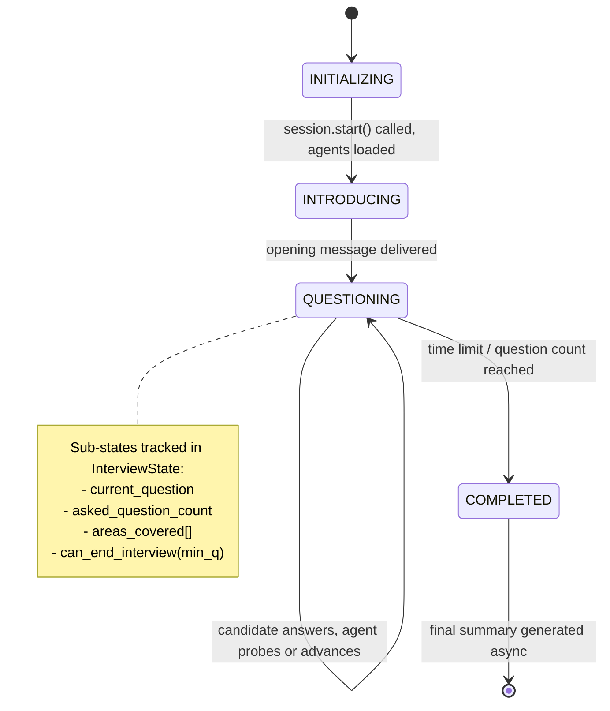
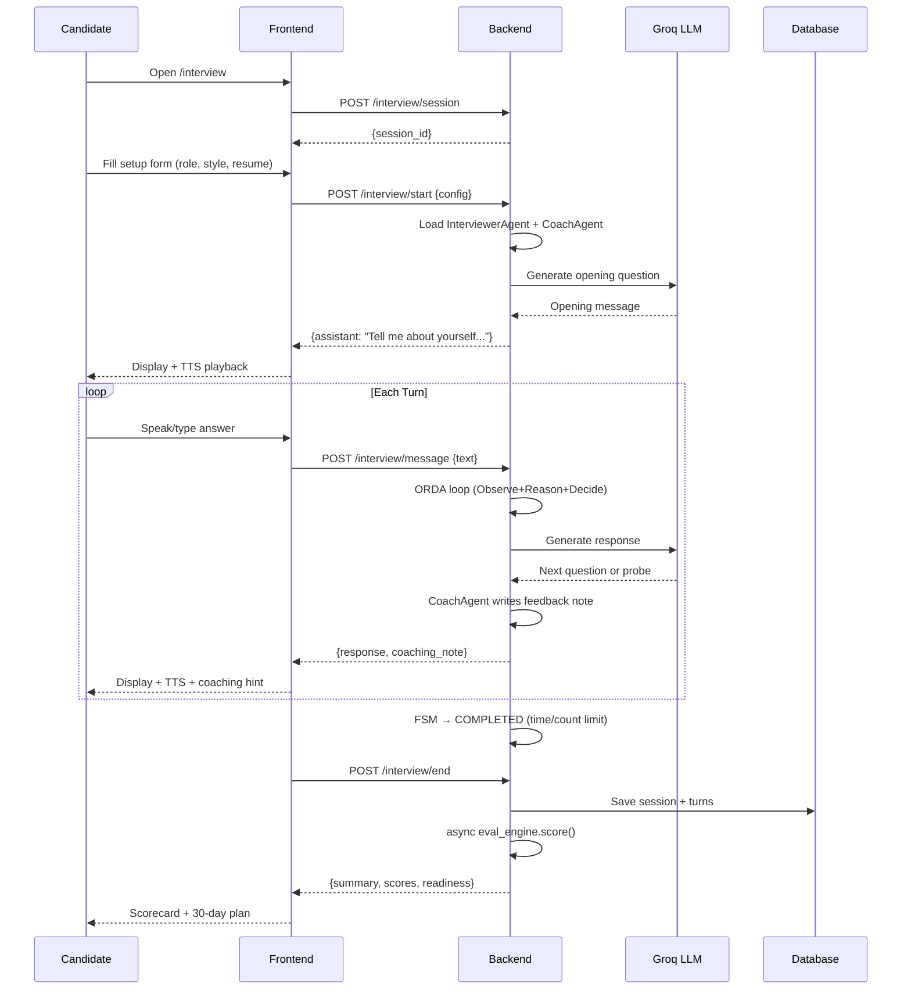

# Project 08 — AI Interview Agent
## Complete Architecture, LLD & System Documentation

> **Stack:** Python 3.11 + FastAPI · React + Vite + Tailwind · SQLAlchemy + SQLite/PostgreSQL · Deepgram STT/TTS · Groq LLM · Docker Compose + Nginx
> **Branch:** `integration/full-merge` · **Repo:** `Prajeeth-12/project-08`

---

## Table of Contents
1. [System Overview](#1-system-overview)
2. [High-Level Architecture](#2-high-level-architecture)
3. [Frontend — Pages & Components](#3-frontend--pages--components)
4. [Frontend Routing & Auth Flow](#4-frontend-routing--auth-flow)
5. [Backend — API Endpoints Reference](#5-backend--api-endpoints-reference)
6. [Agent System — ORDA Loop & FSM](#6-agent-system--orda-loop--fsm)
7. [Database Schema (LLD)](#7-database-schema-lld)
8. [Endpoint Communication Flow](#8-endpoint-communication-flow)
9. [Interview Session Lifecycle](#9-interview-session-lifecycle)
10. [Exam Track Flow](#10-exam-track-flow)
11. [Voice Pipeline](#11-voice-pipeline)
12. [Institutional Layer](#12-institutional-layer)
13. [Docker & Deployment](#13-docker--deployment)
14. [Services & Utilities](#14-services--utilities)

---

## 1. System Overview

Project 08 is a full-stack AI-powered mock interview and coding assessment platform built for college placement preparation. It runs **two independent assessment tracks**:

| Track | Description |
|---|---|
| **Track 1 — Live AI Interview** | Real-time conversational voice interview. Candidate speaks, Deepgram transcribes, LLM generates interviewer response via Groq, TTS plays back audio. Stateful ORDA agent loop with 13-state FSM, probing, resume RAG, and live coaching |
| **Track 2 — Formal Coding Exam** | Scheduled exam with SEB (Safe Exam Browser) lockdown. Timed coding problems, Judge0 sandbox execution, rubric-based scoring |

An **Institutional Layer** wraps both tracks: colleges create organisations → cohorts → placement drives, faculty assign tests and view analytics.

---

## 2. High-Level Architecture

```
┌──────────────────────────────────────────────────────────────────────┐
│                        Browser (React + Vite)                        │
│  LoginPage  RegisterPage  CandidateHome  Interview  Exam  Coding     │
│  Profile    Settings      Dashboard (Faculty/Admin)                  │
│                     AuthContext  ·  api.ts                           │
└────────────────────────────┬─────────────────────────────────────────┘
                             │  HTTP/REST + WebSocket
                    ┌────────▼────────┐
                    │  Nginx (Docker) │  :3000 → proxy → backend:8000
                    └────────┬────────┘
                             │
┌────────────────────────────▼─────────────────────────────────────────┐
│                    FastAPI Backend  :8000                             │
│                                                                      │
│  /auth/*        /interview/*    /speech/*     /blueprint/*           │
│  /session/*     /ws/interview   /files/*      /orgs/*                │
│  /code/*        /exams/*        /resumes/*    /evaluations/*         │
│                                                                      │
│  ┌──────────────┐  ┌─────────────────┐  ┌────────────────────────┐  │
│  │  AuthService │  │  AgentSession   │  │  InstitutionalService  │  │
│  │  (Mock/JWT)  │  │  Manager(ORDA)  │  │  Orgs·Cohorts·Drives   │  │
│  └──────────────┘  └────────┬────────┘  └────────────────────────┘  │
│                             │                                        │
│  ┌──────────────────────────▼──────────────────────────────────┐     │
│  │               Multi-Agent System                            │     │
│  │  InterviewerAgent  ·  AgenticCoachAgent  ·  LLMService      │     │
│  │  RAG(rag/)  ·  Blueprint(blueprint/)  ·  EvalEngine(eval/)  │     │
│  └──────────────────────────────────────────────────────────────┘    │
└──────────────────────────┬───────────────────────────────────────────┘
                           │
        ┌──────────────────┼──────────────────────┐
        │                  │                      │
   ┌────▼────┐     ┌───────▼──────┐     ┌────────▼────────┐
   │ SQLite  │     │  Supabase    │     │  External APIs  │
   │ (local) │     │ PostgreSQL   │     │  Deepgram       │
   │         │     │ (question    │     │  Groq/Gemini    │
   └─────────┘     │  bank + auth)│     │  Judge0         │
                   └──────────────┘     └─────────────────┘
```

---

## 3. Frontend — Pages & Components

### 3.1 Page Inventory

| Route | File | Role Guard | Description |
|---|---|---|---|
| `/` | `LandingPage.tsx` | Public | Marketing landing, entry CTA |
| `/login` | `LoginPage.tsx` | Public | Auth form + dev quick-access buttons |
| `/register` | `RegisterPage.tsx` | Public | Role selector (Candidate / Faculty) + signup |
| `/home` | `CandidateHomePage.tsx` | `candidate` | Dashboard — assigned interviews and exams as cards |
| `/interview` | `Index.tsx` (InterviewPage) | `candidate` | Interview setup wizard + live cockpit |
| `/exam/:examId` | `ExamPage.tsx` | `candidate` | 3-phase: Instructions → Preflight → Live SEB exam |
| `/coding` | `CodingPage.tsx` | `candidate` | 3-panel: problem sidebar + Monaco editor + test console |
| `/profile` | `ProfilePage.tsx` | `candidate` | Resume upload, scorecard, session history, account |
| `/settings` | `SettingsPage.tsx` | `candidate` | Voice preferences, interview defaults |
| `/dashboard` | `DashboardPage.tsx` | `faculty`/`admin` | Cohort performance, candidate list, placement drives |
| `*` | `NotFound.tsx` | Public | 404 fallback |

### 3.2 Component Tree

```
App.tsx
├── AuthProvider (AuthContext.tsx)
│   ├── user, isAuthenticated, isLoading, role
│   ├── login(), register(), logout(), getToken()
│   └── parseJwtPayload() — base64url decode helper
│
├── Router
│   ├── ProtectedRoute.tsx — redirects to /login if not authenticated
│   ├── RoleRoute.tsx — redirects if role doesn't match
│   │
│   ├── LandingPage
│   │   └── Hero, Features, CTA → /login or /register
│   │
│   ├── LoginPage
│   │   ├── Left panel (brand, tagline)
│   │   ├── Email/Password form
│   │   └── Dev quick-access buttons (Candidate / Faculty / Admin)
│   │
│   ├── RegisterPage
│   │   ├── Role picker (Candidate / Faculty tiles)
│   │   └── Name + Email + Password form
│   │
│   ├── CandidateHomePage [ProtectedRoute > RoleRoute:candidate]
│   │   ├── Header.tsx (nav, user avatar, logout)
│   │   ├── Assigned Interviews cards → /interview
│   │   └── Assigned Exams cards → /exam/:id
│   │
│   ├── InterviewPage [candidate]
│   │   ├── Setup panel (role, style, difficulty, resume upload)
│   │   ├── Live Cockpit
│   │   │   ├── Voice waveform + mic toggle
│   │   │   ├── Transcript stream
│   │   │   ├── Probing status indicator
│   │   │   └── Session timer
│   │   └── Hooks: useInterviewSession.ts, useVoiceFirstInterview.ts
│   │
│   ├── ExamPage [candidate]
│   │   ├── Phase 1: Instructions + rules
│   │   ├── Phase 2: Preflight (browser check, SEB detection)
│   │   └── Phase 3: Live exam (problem list, Monaco, submit)
│   │
│   ├── CodingPage [candidate]
│   │   ├── Problem sidebar (description, examples, constraints)
│   │   ├── Monaco Editor (language selector, theme, auto-save)
│   │   └── TestConsole (run, judge output, pass/fail)
│   │
│   ├── ProfilePage [candidate]
│   │   ├── Resume tab (upload PDF, parsed claims)
│   │   ├── Scorecard tab (radar chart, dimension scores)
│   │   └── History tab (past sessions)
│   │
│   └── DashboardPage [faculty/admin]
│       ├── Overview tab — cohort performance table
│       ├── Candidates tab — per-student stats
│       └── Drives tab — placement drive management
│
└── Toaster (toast notifications)
```

### 3.3 Key Hooks & Services

| File | Purpose |
|---|---|
| `hooks/useInterviewSession.ts` | Manages REST session lifecycle (create, start, message, end) |
| `hooks/useVoiceFirstInterview.ts` | Handles Deepgram mic stream, audio playback, WebSocket voice channel |
| `services/api.ts` | Axios client — all typed API calls, token injection via interceptor |
| `contexts/AuthContext.tsx` | Auth state, token storage in localStorage, JWT role decode |

---

## 4. Frontend Routing & Auth Flow

```mermaid
flowchart TD
    A[Browser visits /] --> B{isAuthenticated?}
    B -- No --> C[LandingPage]
    B -- Yes --> D{user.role}
    D -- candidate --> E[/home]
    D -- faculty/admin --> F[/dashboard]

    G[/login] --> H[POST /auth/login]
    H -- success --> I[Store tokens in localStorage]
    I --> D

    J[Any protected route] --> K{ProtectedRoute}
    K -- not authed --> L[Redirect /login + save from path]
    K -- authed --> M{RoleRoute}
    M -- wrong role --> N[Redirect /home or /dashboard]
    M -- correct role --> O[Render page]

    P[Token refresh] --> Q[POST /auth/refresh on 401]
    Q -- success --> R[Retry original request]
    Q -- fail --> S[Logout + redirect /login]
```

### Auth Token Flow

```
Register/Login
    │
    ▼
POST /auth/register or /auth/login
    │
    ▼  (Mock mode)
_mock_tokens() ──► JWT {sub, email, name, role, exp}
    │
    ▼
AuthTokenResponse { access_token, refresh_token, user{id,email,name,role} }
    │
    ▼
Frontend: parseJwtPayload(access_token) → extract role
localStorage: aia_access_token, aia_refresh_token, aia_user
axios.defaults.headers.Authorization = "Bearer <token>"
    │
    ▼
All subsequent requests carry Bearer token
GET /auth/me → verify + return updated profile
```

---

## 5. Backend — API Endpoints Reference

### 5.1 Auth  `/auth/*`

| Method | Path | Auth | Description |
|---|---|---|---|
| `POST` | `/auth/register` | — | Register new user; mock mode: returns JWT immediately |
| `POST` | `/auth/login` | — | Login; mock: returns JWT with role derived from email |
| `POST` | `/auth/refresh` | — | Refresh access token using refresh token |
| `GET` | `/auth/me` | Bearer | Get current user profile |
| `POST` | `/auth/logout` | Bearer | Revoke session (Cognito global sign-out in prod) |
| `DELETE` | `/auth/me/data` | Bearer | GDPR/DPDPA right to deletion — wipes all user data |

**Mock credentials** (dev, `USE_MOCK_AUTH=true`):
- `candidate@dev.example.com` / `Test1234!` → role: `candidate`
- `faculty@dev.example.com` / `Test1234!` → role: `faculty`
- `admin@dev.example.com` / `Test1234!` → role: `admin`

### 5.2 Interview Agent  `/interview/*`  +  `/session/*`

| Method | Path | Auth | Description |
|---|---|---|---|
| `POST` | `/interview/session` | Bearer | Create session, returns `session_id` |
| `POST` | `/interview/start` | Bearer | Load agents, start FSM, return opening message |
| `POST` | `/interview/message` | Bearer | Send candidate turn, get agent response |
| `POST` | `/interview/end` | Bearer | Terminate session, trigger async eval |
| `GET` | `/interview/final-summary-status` | Bearer | Poll evaluation completion |
| `GET` | `/interview/history` | Bearer | Full conversation history |
| `GET` | `/interview/stats` | Bearer | Tokens used, response times, turn count |
| `GET` | `/interview/per-turn-feedback` | Bearer | Coaching notes per turn |
| `POST` | `/interview/reset` | Bearer | Destroy and recreate session |
| `GET` | `/session/time-remaining` | Bearer | Seconds left in timed interview |
| `POST` | `/session/ping` | Bearer | Heartbeat to prevent idle timeout |
| `POST` | `/session/cleanup` | Bearer | Force-release session resources |
| `GET` | `/interview/scorecard/history` | Bearer | Past session scorecards |
| `WS` | `/ws/interview/{session_id}` | Token param | WebSocket for real-time voice channel |

### 5.3 Speech  `/speech/*`

| Method | Path | Auth | Description |
|---|---|---|---|
| `POST` | `/speech/tts` | Bearer | Text-to-speech via Deepgram Aura-2 |
| `POST` | `/speech/stt` | Bearer | Speech-to-text upload (file or stream) |
| `GET` | `/speech/voices` | Bearer | List available TTS voices |
| `WS` | `/speech/stream` | Token | Real-time STT stream |

### 5.4 Blueprint  `/blueprint/*`

| Method | Path | Auth | Description |
|---|---|---|---|
| `POST` | `/blueprint/plan` | Bearer | Generate interview question plan from role + JD |
| `GET` | `/blueprint/{blueprint_id}` | Bearer | Retrieve saved blueprint |
| `GET` | `/blueprint/list` | Bearer | List user's blueprints |

### 5.5 Resume / Files  `/resumes/*`  `/files/*`

| Method | Path | Auth | Description |
|---|---|---|---|
| `POST` | `/resumes/parse` | Bearer | Upload PDF → extract structured claims |
| `GET` | `/resumes/{user_id}` | Bearer | Retrieve parsed resume claims |
| `POST` | `/files/upload` | Bearer | Upload supporting doc (PDF, DOCX) |
| `GET` | `/files/{file_id}` | Bearer | Retrieve uploaded file |

### 5.6 Exams  `/exams/*`

| Method | Path | Auth | Description |
|---|---|---|---|
| `POST` | `/exams/create` | Bearer (faculty) | Create exam with question pool |
| `GET` | `/exams/{exam_id}` | Bearer | Exam metadata + questions |
| `POST` | `/exams/{exam_id}/start` | Bearer | Begin attempt, return attempt ID |
| `POST` | `/exams/{exam_id}/infraction` | Bearer | Log SEB integrity violation |
| `POST` | `/exams/{exam_id}/submit` | Bearer | Submit solution, trigger Judge0 evaluation |

### 5.7 Code Execution  `/code/*`

| Method | Path | Auth | Description |
|---|---|---|---|
| `POST` | `/code/execute` | Bearer | Run code in Judge0 sandbox (2s CPU, 128MB RAM) |
| `POST` | `/code/drafts` | Bearer | Auto-save editor draft |
| `GET` | `/code/drafts/{draft_id}` | Bearer | Load saved draft |

### 5.8 Evaluations  `/evaluations/*`

| Method | Path | Auth | Description |
|---|---|---|---|
| `POST` | `/evaluations/score` | Bearer | Run rubric scorer on session transcript |
| `GET` | `/evaluations/{session_id}` | Bearer | Get evaluation result |

### 5.9 Institutional  `/orgs/*`

| Method | Path | Auth | Description |
|---|---|---|---|
| `POST` | `/orgs/` | Bearer (admin) | Create organisation |
| `GET` | `/orgs/{org_id}` | Bearer | Organisation details |
| `GET` | `/orgs/{org_id}/stats` | Bearer | Aggregate stats |
| `POST` | `/orgs/{org_id}/cohorts` | Bearer | Create cohort |
| `GET` | `/orgs/{org_id}/cohorts` | Bearer | List cohorts |
| `POST` | `/orgs/{org_id}/cohorts/{id}/members` | Bearer | Add candidates to cohort |
| `POST` | `/orgs/{org_id}/drives` | Bearer | Create placement drive |
| `GET` | `/orgs/{org_id}/drives` | Bearer | List drives |
| `POST` | `/orgs/{org_id}/drives/{id}/allocate` | Bearer | Assign candidates to drive |
| `GET` | `/orgs/{org_id}/drives/{id}/results` | Bearer | Drive results |
| `GET` | `/orgs/{org_id}/analytics/overview` | Bearer | Cohort performance dashboard data |
| `GET` | `/orgs/{org_id}/analytics/candidates` | Bearer | Per-candidate analytics |

---

## 6. Agent System — ORDA Loop & FSM

### 6.1 ORDA Loop (Observe → Reason → Decide → Act)

Every candidate message passes through the ORDA loop inside `AgentSessionManager`:

```
Candidate message
        │
        ▼
┌───────────────┐
│   OBSERVE     │  Raw transcript from STT / direct text input
│               │  Enriched with: session metadata, resume claims,
│               │  turn count, time remaining, covered topics
└───────┬───────┘
        │
        ▼
┌───────────────┐
│    REASON     │  InterviewerAgent evaluates:
│               │  - Is the answer complete?
│               │  - Should we probe deeper?
│               │  - Which topic area to address next?
│               │  - Has time/question limit been reached?
└───────┬───────┘
        │
        ▼
┌───────────────┐
│    DECIDE     │  Choose action:
│               │  PROBE  → follow-up question on same topic
│               │  ADVANCE → move to next question/topic
│               │  END    → conclude interview
│               │  COACH  → route to AgenticCoachAgent for feedback
└───────┬───────┘
        │
        ▼
┌───────────────┐
│     ACT       │  Generate response via LLMService (Groq)
│               │  AgenticCoachAgent writes per-turn coaching note
│               │  EventBus publishes SESSION_TURN event
│               │  Response + coaching note returned to frontend
└───────────────┘
```

### 6.2 Interview FSM (13 States via InterviewPhase)



### 6.3 Agent Roles

| Agent | Class | Responsibility |
|---|---|---|
| **Orchestrator** | `AgentSessionManager` | Routes messages, manages ORDA loop, holds conversation history, coordinates agents |
| **Interviewer** | `InterviewerAgent` | Generates system prompt, tracks FSM state, decides probe/advance/end, zero-LLM controller |
| **Coach** | `AgenticCoachAgent` | Writes per-turn real-time coaching feedback using LLM; logs to `per_turn_coaching_feedback_log` |
| **LLM Service** | `LLMService` | Singleton Groq client (openai/gpt-oss-120b default); fallback chain for providers |
| **RAG** | `rag/parser.py` + `rag/file_guard.py` | PDF resume ingestion → chunking → vector search → resume claims for ORDA context |
| **Blueprint** | `blueprint/` | Generates structured interview question plan from job role + JD |
| **Eval Engine** | `eval_engine/` | Rubric scorer, STAR evaluator, readiness rating, 30-day coach plan, narrative report |

### 6.4 EventBus

Internal pub/sub decoupling all agent components:

```
EventType.SESSION_START   → emitted on AgentSessionManager init
EventType.SESSION_TURN    → emitted after every message processed
EventType.SESSION_END     → emitted on end(), triggers async eval
EventType.ERROR           → emitted on any agent failure
```

---

## 7. Database Schema (LLD)

### 7.1 Entity Relationship

```
platform_users
    │
    ├──< interview_sessions ──< interview_turns
    │         │
    │         └──< interview_blueprints
    │
    ├──< candidate_profiles ──< resume_claims
    │
    ├──< code_drafts
    ├──< code_submissions
    ├──< formal_exams ──< exam_attempts
    └──< rubric_evaluations

organisations
    │
    └──< cohorts ──< cohort_members (→ platform_users)
              │
              └──< placement_drives ──< drive_allocations (→ platform_users)
```

### 7.2 Core Tables (`backend/models/core.py`)

```sql
platform_users
  id            UUID PK
  email         VARCHAR UNIQUE
  name          VARCHAR
  role          ENUM(candidate, faculty, admin)
  auth_provider_id VARCHAR   -- Cognito sub in prod
  created_at    TIMESTAMP

interview_sessions
  id            UUID PK
  user_id       UUID FK→platform_users
  job_role      VARCHAR
  style         VARCHAR
  difficulty    VARCHAR
  status        ENUM(active, completed, abandoned)
  started_at    TIMESTAMP
  ended_at      TIMESTAMP
  summary       JSONB        -- final eval output

interview_turns
  id            UUID PK
  session_id    UUID FK→interview_sessions
  turn_number   INT
  role          ENUM(user, assistant, coach)
  content       TEXT
  coaching_note TEXT
  created_at    TIMESTAMP

interview_blueprints
  id            UUID PK
  user_id       UUID FK
  job_role      VARCHAR
  questions     JSONB
  created_at    TIMESTAMP

candidate_profiles
  id            UUID PK
  user_id       UUID FK→platform_users UNIQUE
  resume_text   TEXT
  skills        JSONB
  updated_at    TIMESTAMP

resume_claims
  id            UUID PK
  user_id       UUID FK
  claim_type    VARCHAR      -- skill, experience, education
  claim_text    TEXT
  confidence    FLOAT

code_drafts
  id            UUID PK
  user_id       UUID FK
  language      VARCHAR
  content       TEXT
  updated_at    TIMESTAMP

code_submissions
  id            UUID PK
  user_id       UUID FK
  exam_id       UUID FK
  language      VARCHAR
  source_code   TEXT
  judge0_token  VARCHAR
  status        VARCHAR
  stdout        TEXT
  stderr        TEXT
  runtime_ms    FLOAT
  submitted_at  TIMESTAMP

formal_exams
  id            UUID PK
  title         VARCHAR
  created_by    UUID FK
  questions     JSONB
  time_limit_s  INT
  status        ENUM(draft, active, archived)

exam_attempts
  id            UUID PK
  exam_id       UUID FK→formal_exams
  user_id       UUID FK
  started_at    TIMESTAMP
  submitted_at  TIMESTAMP
  infraction_count INT
  score         FLOAT
  status        ENUM(in_progress, submitted, voided)

rubric_evaluations
  id            UUID PK
  session_id    UUID FK→interview_sessions
  scores        JSONB        -- per-dimension scores
  readiness     FLOAT
  report_text   TEXT
  created_at    TIMESTAMP
```

### 7.3 Institutional Tables (`backend/models/institutional.py`)

```sql
organisations
  id            UUID PK
  name          VARCHAR
  type          VARCHAR      -- college, company
  admin_id      UUID FK→platform_users
  created_at    TIMESTAMP

cohorts
  id            UUID PK
  org_id        UUID FK→organisations
  name          VARCHAR
  batch_year    INT
  created_at    TIMESTAMP

cohort_members
  cohort_id     UUID FK→cohorts
  user_id       UUID FK→platform_users
  joined_at     TIMESTAMP
  PRIMARY KEY (cohort_id, user_id)

placement_drives
  id            UUID PK
  org_id        UUID FK→organisations
  title         VARCHAR
  company       VARCHAR
  drive_date    DATE
  status        ENUM(upcoming, active, completed)

drive_allocations
  drive_id      UUID FK→placement_drives
  user_id       UUID FK→platform_users
  status        ENUM(invited, accepted, appeared, selected)
  PRIMARY KEY (drive_id, user_id)
```

---

## 8. Endpoint Communication Flow

### 8.1 Login Flow

```
Browser                  Frontend                  Backend
  │                         │                         │
  │  click "Admin" dev btn  │                         │
  │────────────────────────>│                         │
  │                         │  setEmail/setPassword   │
  │  submit form            │                         │
  │────────────────────────>│                         │
  │                         │  POST /auth/login       │
  │                         │  {email, password}      │
  │                         │────────────────────────>│
  │                         │                         │ USE_MOCK_AUTH=true
  │                         │                         │ _mock_tokens()
  │                         │                         │ JWT {role: "admin"}
  │                         │<────────────────────────│
  │                         │  {access_token,         │
  │                         │   refresh_token, user}  │
  │                         │                         │
  │                         │ parseJwtPayload(token)  │
  │                         │ → role = "admin"        │
  │                         │ localStorage.set(...)   │
  │                         │ navigate("/dashboard")  │
  │<────────────────────────│                         │
  │  DashboardPage renders  │                         │
```

### 8.2 Interview Session Flow

```
CandidateHome              Frontend api.ts            Backend
      │                         │                         │
      │  click "Start Interview"│                         │
      │────────────────────────>│                         │
      │                         │  POST /interview/session│
      │                         │────────────────────────>│
      │                         │<── {session_id}         │
      │                         │                         │
      │  setup form filled      │                         │
      │────────────────────────>│                         │
      │                         │  POST /interview/start  │
      │                         │  {session_id, job_role, │
      │                         │   style, resume_content}│
      │                         │────────────────────────>│
      │                         │                         │ InterviewerAgent.init()
      │                         │                         │ AgenticCoachAgent.init()
      │                         │                         │ FSM → INTRODUCING
      │                         │<── {role:"assistant",   │
      │                         │    content:"Hello..."}  │
      │                         │                         │
      │  speak / type answer    │                         │
      │────────────────────────>│                         │
      │                         │  POST /interview/message│
      │                         │  {session_id, message}  │
      │                         │────────────────────────>│
      │                         │                         │ ORDA loop:
      │                         │                         │  Observe → Reason
      │                         │                         │  Decide → Act
      │                         │                         │ LLMService.generate()
      │                         │                         │ CoachAgent.note()
      │                         │<── {role:"assistant",   │
      │                         │    content: "...",      │
      │                         │    coaching_note: "..."}│
      │  [repeat turns]         │                         │
      │                         │                         │
      │                         │  POST /interview/end    │
      │                         │────────────────────────>│
      │                         │                         │ FSM → COMPLETED
      │                         │                         │ async: eval_engine
      │                         │<── {summary, scores}    │
```

### 8.3 Exam Submission Flow

```
ExamPage                  api.ts                   Backend + Judge0
    │                       │                           │
    │  Phase 2: SEB check   │                           │
    │  Phase 3: code        │                           │
    │  click Submit         │                           │
    │──────────────────────>│                           │
    │                       │  POST /exams/{id}/submit  │
    │                       │  {code, language}         │
    │                       │──────────────────────────>│
    │                       │                           │ POST Judge0 /submissions
    │                       │                           │ {source_code, language_id}
    │                       │                           │ poll token for result
    │                       │                           │ store in code_submissions
    │                       │<── {status, stdout, score}│
    │  results displayed    │                           │
```

---

## 9. Interview Session Lifecycle



---

## 10. Exam Track Flow

```mermaid
flowchart LR
    A[/exam/:id] --> B[Phase 1: Instructions]
    B --> C{SEB Detected?}
    C -- No --> D[Show SEB download link]
    C -- Yes --> E[Phase 3: Live Exam]

    E --> F[Load questions from /exams/:id]
    F --> G[Monaco Editor]
    G --> H{Integrity checks}
    H -- violation --> I[POST /exams/:id/infraction]
    H -- ok --> G
    G --> J[POST /code/execute for test run]
    J --> K[Judge0 result display]
    G --> L[POST /exams/:id/submit]
    L --> M[Final Judge0 evaluation]
    M --> N[Score persisted to exam_attempts]
```

---

## 11. Voice Pipeline

```
Microphone
    │
    ▼
Deepgram WebSocket stream (STT)
    │  Real-time transcript chunks
    ▼
useVoiceFirstInterview hook
    │  Assembles complete utterance
    ▼
POST /interview/message {message: transcript}
    │
    ▼
ORDA loop → LLM generates text response
    │
    ▼
POST /speech/tts {text: response}
    │
    ▼
Deepgram Aura-2 (aura-2-asteria-en)
    │  Returns audio bytes
    ▼
Browser AudioContext.play()
    │
    ▼
Candidate hears interviewer response
```

**Voice Engine Fallback Chain:**
```
Deepgram Aura-2 (primary)
    │ fail
    ▼
Gemini Voice (gemini-3.8-live / voice: Aoede)
    │ fail
    ▼
Browser Web Speech API (TTS fallback, no STT)
```

---

## 12. Institutional Layer

```
Organisation (college / company)
│
├── Faculty / Admin Users
│
├── Cohorts (e.g. "CSE 2026 Batch")
│   ├── Members → candidate users
│   └── Analytics (avg score, readiness, interviews completed)
│
└── Placement Drives
    ├── Title, Company, Date
    ├── Allocations → candidates invited/appeared/selected
    └── Results → per-candidate outcome
```

**DashboardPage tabs:**
- **Overview** → `GET /orgs/{id}/analytics/overview` → cohort performance table
- **Candidates** → `GET /orgs/{id}/analytics/candidates` → per-student breakdown
- **Drives** → `GET /orgs/{id}/drives` → placement drive list + `POST /orgs/{id}/drives/{id}/allocate`

---

## 13. Docker & Deployment

### 13.1 Container Architecture

```
docker compose up --build
        │
        ├── backend (Dockerfile.backend)
        │   ├── python:3.11-slim
        │   ├── build-essential, python3-dev, libpq-dev, curl
        │   ├── pip install -r backend/requirements.txt
        │   ├── WORKDIR /app, PYTHONPATH=/app
        │   ├── Non-root user: appuser
        │   ├── Volume: db_data → /app/data (SQLite persistence)
        │   ├── Port: 8000 (internal)
        │   └── Healthcheck: GET /health every 30s, start_period 20s
        │
        └── frontend (Dockerfile.frontend)
            ├── Stage 1: node:20-alpine → npm ci → vite build
            │   └── VITE_API_BASE_URL="" (nginx handles routing)
            └── Stage 2: nginx:alpine
                ├── Serve /usr/share/nginx/html (built dist)
                ├── Port: 80 → mapped 3000:80
                └── nginx.conf:
                    /        → React SPA (index.html fallback)
                    /api/    → proxy backend:8000
                    /auth/   → proxy backend:8000
                    /interview/ → proxy backend:8000
                    /orgs/   → proxy backend:8000
                    /ws/     → WebSocket proxy backend:8000
```

### 13.2 Quick Start

```bash
# Any machine, zero config (runs in mock mode)
git clone https://github.com/Prajeeth-12/project-08
cd project-08/integrated-interview-agent
docker compose up --build

# Frontend: http://localhost:3000
# Login:    admin@dev.example.com / Test1234!

# With real API keys:
cp backend/.env.example backend/.env
# fill in GROQ_API_KEY, DEEPGRAM_API_KEY, etc.
docker compose up --build
```

### 13.3 Local Dev (Windows)

```bash
# Backend (port 8010)
cd backend && venv\Scripts\activate
PYTHONPATH=.. USE_MOCK_AUTH=true uvicorn main:app --port 8010

# Frontend (port 8000-8004, whichever is free)
cd frontend && npm run dev

# Or use:
run_venv.bat   # opens both in separate cmd windows
```

---

## 14. Services & Utilities

| Service | File | Role |
|---|---|---|
| `LLMService` | `services/llm_service.py` | Singleton Groq client; provider abstraction (Gemini/OpenAI-compatible) |
| `ThreadSafeSessionRegistry` | `services/session_manager.py` | In-memory session store with cleanup (15 min idle timeout) |
| `SearchService` | `services/search_service.py` | Web search for interview context enrichment |
| `APIRateLimiter` | `services/rate_limiting.py` | Token bucket per user per endpoint |
| `EventBus` | `utils/event_bus.py` | Async pub/sub; decouples agents from services |
| `InterviewTimeManager` | `utils/time_manager.py` | Hard time limit enforcement, per-turn countdown |
| `MockDatabaseManager` | `database/mock_db_manager.py` | In-memory DB for local dev without PostgreSQL |
| `DatabaseManager` | `database/db_manager.py` | SQLAlchemy async session wrapper |
| `SessionGuard` (V3) | `agents/session_guard.py` | Hard cap on turns + time; prevents runaway sessions |

---

*Generated from live codebase via graphify knowledge graph · `integration/full-merge` · Sep 2026*
