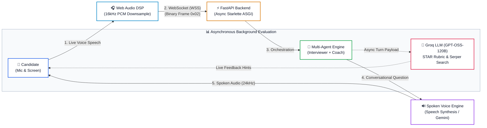
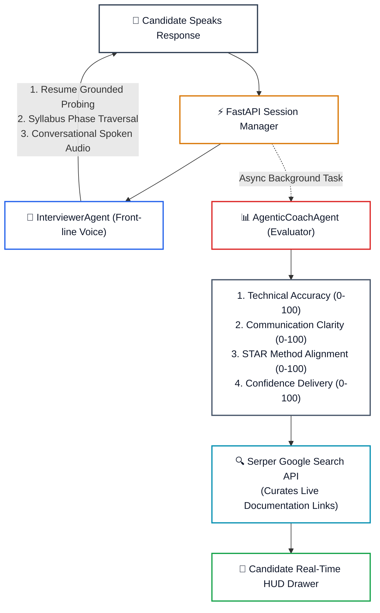
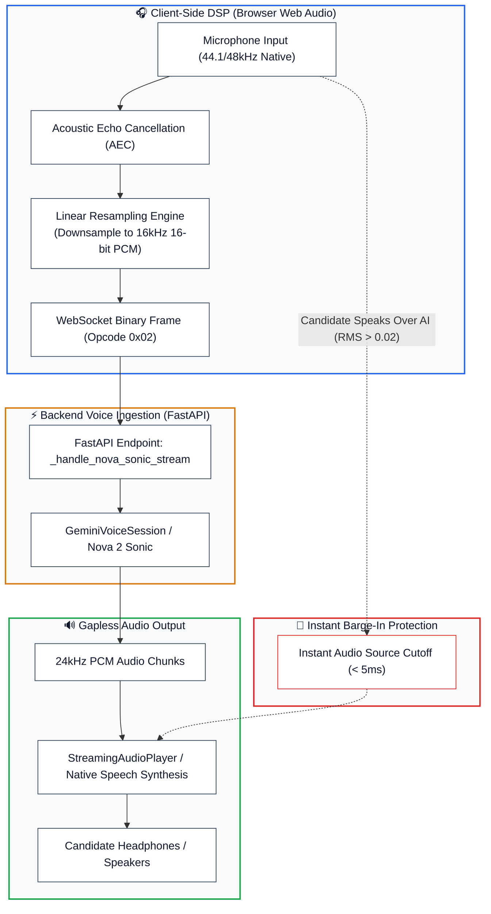
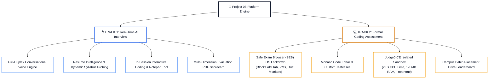
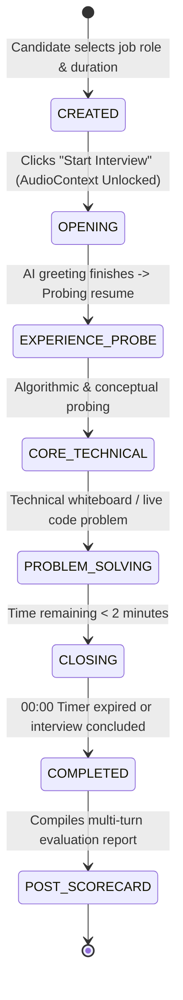

# Project 08: AI Mock Interview & Evaluation Platform
# Visual Architecture & Flow Diagrams (High-Contrast Mentor Guide)

**Lead Architect:** Prajeeth  
**System:** Project 08 Enterprise Two-Track Assessment Platform  

---

## 1. High-Level End-to-End System Flow

---

## 2. Decoupled Multi-Agent Core

I designed a decoupled dual-agent architecture so conversational voice turns experience zero latency penalty while deep rubric evaluations run concurrently in the background.

---

## 3. Real-Time Voice & Audio DSP Pipeline

---

## 4. Two-Track Assessment Architecture

---

## 5. Interview Session Finite State Machine (FSM)

---

## 6. How to Explain This to Your Mentor in 60 Seconds

1. **Core Concept:** *"I architected Project 08 as a Two-Track platform. Track 1 is a full-duplex conversational AI interviewer with real-time voice and dynamic probing. Track 2 is a locked-down formal coding exam environment with Safe Exam Browser (SEB) and Judge0 sandbox execution."*
2. **Sub-800ms Latency:** *"To eliminate conversational lag, I bypassed traditional batch STT/TTS and built a duplex WebSocket pipeline streaming binary 16kHz PCM audio directly between the browser's Web Audio DSP engine and our backend agent broker."*
3. **Decoupled Multi-Agent:** *"I separated concerns between `InterviewerAgent` (which handles the live conversational persona and question flow) and `AgenticCoachAgent` (which asynchronously computes STAR rubric scores and queries the Serper Search API for learning materials without blocking audio turns)."*
4. **Reliability & Hardware Handling:** *"The client features linear interpolation downsampling, acoustic echo cancellation, zero-gain feedback routing, instantaneous barge-in cutoff, and hybrid speech synthesis."*
