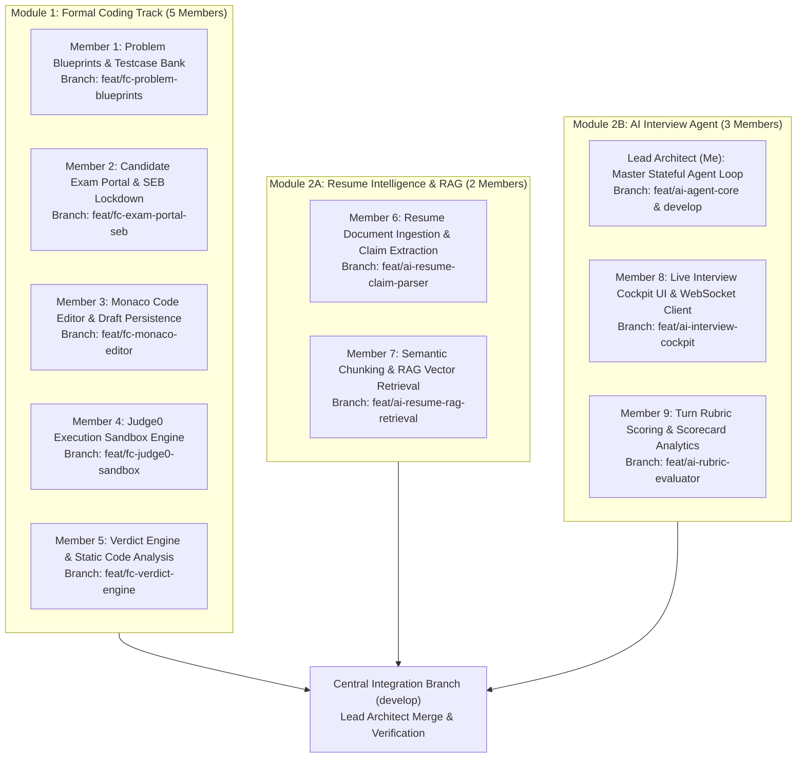
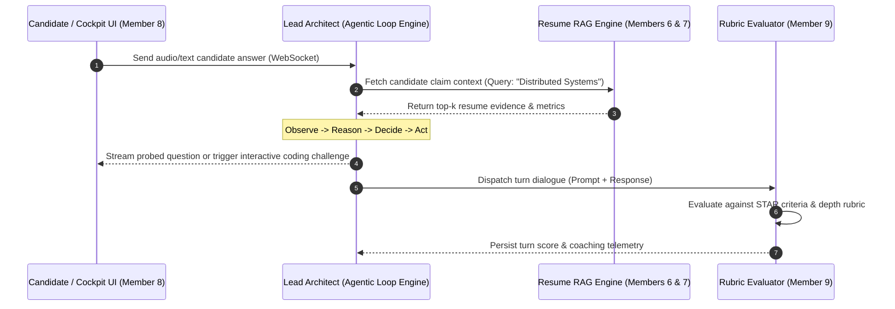
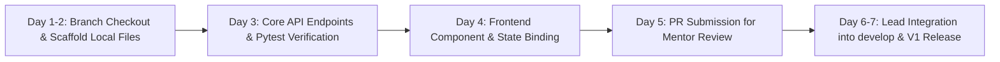

# Project 08: V1 Master Execution & Team Allocation Plan (`plan.md`)
**Author:** Prajeeth (Team Lead & Lead Architect)  
**System:** Project 08 (AI Mock Interview & Assessment Platform)  
**Date:** September 16, 2026  
**Target Milestone:** Version 1.0 (End of Week 1 Release)  

---

## 1. Executive Summary & Objective

Our team of 10 engineering students is building and deploying **Project 08**, a two-track assessment platform comprising:
1. **Module 1: Formal Coding Track** — Standalone scheduled examinations with Safe Exam Browser (SEB) lockdown, problem blueprints, Monaco code editor, Judge0 execution sandbox, and automated submission grading.
2. **Module 2: AI Live Interview Track** — Conversational AI mock interview powered by candidate resume intelligence (RAG), a stateful agent probing loop (**Observe -> Reason -> Decide -> Act**), a live interview cockpit, and turn-by-turn rubric evaluation.

Our mentor has been added as a GitHub collaborator to review Pull Requests (PRs), assess individual code quality, verify automated tests, and award marks. To eliminate merge conflicts and ensure clear grading evidence for all 10 students, I have partitioned the workload into **vertical feature slices**. Each student owns an isolated frontend component, backend API router, database model, and test suite.



---

## 2. 10-Member Master Allocation Matrix

| # | Student Role | Module | Assigned Branch | Frontend Component | Backend API Router | DB Model | Pytest Suite |
|---|---|---|---|---|---|---|---|
| **1** | Problem Blueprints | Formal Coding | `feat/fc-problem-blueprints` | `frontend/components/team_b/QuestionBank.tsx` | `backend/api/questions.py` | `backend/models/blueprint.py` | `backend/tests/test_questions.py` |
| **2** | SEB Exam Portal | Formal Coding | `feat/fc-exam-portal-seb` | `frontend/components/team_b/ExamPortal.tsx` | `backend/api/exams.py` | `backend/models/formal_exam.py` | `backend/tests/test_exams.py` |
| **3** | Monaco Code Editor | Formal Coding | `feat/fc-monaco-editor` | `frontend/components/team_a/MonacoEditor.tsx` | `backend/api/drafts.py` | `backend/models/draft.py` | `backend/tests/test_drafts.py` |
| **4** | Judge0 Sandbox | Formal Coding | `feat/fc-judge0-sandbox` | `frontend/components/team_a/TestConsole.tsx` | `backend/api/execution.py` | `backend/models/submission.py` | `backend/tests/test_execution.py` |
| **5** | Verdict & Review | Formal Coding | `feat/fc-verdict-engine` | `frontend/components/team_a/CodeReviewCard.tsx` | `backend/api/code_review.py` | `backend/models/review.py` | `backend/tests/test_code_review.py` |
| **6** | Resume Claim Parser | AI Interview (RAG) | `feat/ai-resume-claim-parser` | `frontend/components/team_b/ResumeViewer.tsx` | `backend/api/resumes.py` | `backend/models/resume_claim.py` | `backend/tests/test_resumes.py` |
| **7** | RAG Vector Engine | AI Interview (RAG) | `feat/ai-resume-rag-retrieval` | `frontend/components/team_b/AuthModal.tsx` | `backend/api/auth.py` | `backend/models/user.py` | `backend/tests/test_auth.py` |
| **8** | Interview Cockpit | AI Interview (Agent) | `feat/ai-interview-cockpit` | `frontend/components/team_a/LiveCockpit.tsx` | `backend/api/sessions.py` | `backend/models/session.py` | `backend/tests/test_sessions.py` |
| **9** | Rubric Evaluator | AI Interview (Agent) | `feat/ai-rubric-evaluator` | `frontend/components/team_b/ScorecardView.tsx` | `backend/api/evaluations.py` | `backend/models/rubric.py` | `backend/tests/test_evaluations.py` |
| **10**| **Lead Architect (Me)**| Master Orchestration | `feat/ai-agent-core` & `develop` | `frontend/app/page.tsx` & Root Layout | `backend/main.py` & Agent Core | Master Schemas | Integration Test Suite |

---

## 3. Module 1: Formal Coding Track (5 Members)

### Member 1: Problem Blueprints & Testcase Bank
* **Branch:** `feat/fc-problem-blueprints`
* **Objective:** Build the authoring and cataloging engine for coding problems and test suites.
* **Component Responsibilities:**
  * **Frontend (`QuestionBank.tsx`):** Problem browser with difficulty badges (Easy, Medium, Hard), tag filters (Array, DP, Graph), search bar, and problem statement preview card with sample I/O.
  * **Backend API (`questions.py`):**
    * `GET /api/v1/questions` — List paginated problems with difficulty/tag filtering.
    * `GET /api/v1/questions/{id}` — Retrieve problem specification, sample test cases, and starter code boilerplate. Excludes hidden test cases for candidate security.
    * `POST /api/v1/questions` — Admin endpoint to create new blueprints with both visible sample test cases and hidden test cases.
  * **DB Model (`blueprint.py`):** `ProblemBlueprint` table storing metadata, constraints (time limit, memory limit), starter boilerplate dict, and relational test case arrays.
  * **Tests (`test_questions.py`):** Verify CRUD endpoints, public vs hidden test case masking, and filter validation.

---

### Member 2: Candidate Exam Portal & SEB Lockdown Environment
* **Branch:** `feat/fc-exam-portal-seb`
* **Objective:** Secure assessment entry, passcode verification, countdown timing, and lockdown proctoring.
* **Component Responsibilities:**
  * **Frontend (`ExamPortal.tsx`):** Full-screen exam dashboard with live countdown clock, proctoring warning banner, candidate profile chip, and violation alert modal.
  * **Backend API (`exams.py`):**
    * `POST /api/v1/exams/start` — Validate exam passkey, issue session token, and verify Safe Exam Browser (SEB) configuration headers.
    * `POST /api/v1/exams/event` — Telemetry ingest logging candidate proctoring events: tab switch, window blur, exit full-screen, or copy-paste attempt.
    * `GET /api/v1/exams/{id}/status` — Check remaining duration and active status.
  * **DB Model (`formal_exam.py`):** `FormalExam` and `ExamSession` tables tracking exam windows, allowed IP/SEB keys, and security violation counts.
  * **Tests (`test_exams.py`):** Validate access passkeys, expiry logic, and violation logging.

---

### Member 3: Multi-Language Monaco Code Editor & Draft Persistence
* **Branch:** `feat/fc-monaco-editor`
* **Objective:** Deliver a responsive in-browser IDE with boilerplate injection and continuous auto-save.
* **Component Responsibilities:**
  * **Frontend (`MonacoEditor.tsx`):** Monaco Editor integration supporting Python (3.11), Java (OpenJDK 17), C++ (GCC 9.2), and JavaScript (Node 18). Includes theme switching (vs-dark / light), font scaling, language dropdown, and a live "Auto-saved 2s ago" status chip.
  * **Backend API (`drafts.py`):**
    * `POST /api/v1/drafts/save` — Debounced endpoint receiving code snapshots every 3 seconds.
    * `GET /api/v1/drafts/latest` — Restore the latest code snapshot on page reload or connection recovery.
  * **DB Model (`draft.py`):** `CodeDraft` table storing candidate ID, problem ID, language identifier, source code buffer, and timestamp.
  * **Tests (`test_drafts.py`):** Validate draft upserts, language switching, and snapshot retrieval.

---

### Member 4: Judge0 Execution Sandbox & Runner API
* **Branch:** `feat/fc-judge0-sandbox`
* **Objective:** Secure, asynchronous code execution against custom inputs using Judge0 CE.
* **Component Responsibilities:**
  * **Frontend (`TestConsole.tsx`):** Tabbed execution panel with custom stdin input area, stdout output terminal, stderr display, execution time indicator, and peak memory gauge.
  * **Backend API (`execution.py`):**
    * `POST /api/v1/execution/run` — Format submission payload, enforce resource limits (2.0s CPU timeout, 128MB RAM bound), dispatch to Judge0 CE, and return async execution token.
    * `GET /api/v1/execution/status/{token}` — Poll Judge0 CE status with exponential backoff until completion.
  * **DB Model (`submission.py`):** `ExecutionJob` tracking token, language ID, status (In Queue, Processing, Completed), runtime, and memory.
  * **Tests (`test_execution.py`):** Mock Judge0 responses, verify timeout enforcement, and check output sanitization.

---

### Member 5: Assessment Verdict Engine & Static Code Analysis
* **Branch:** `feat/fc-verdict-engine`
* **Objective:** Automated assessment grading against hidden test suites and AST code analysis.
* **Component Responsibilities:**
  * **Frontend (`CodeReviewCard.tsx`):** Post-submission verdict card showing overall score, passed test case ratio (e.g. 10/10 Passed), time/space complexity analysis, and clean code suggestions.
  * **Backend API (`code_review.py`):**
    * `POST /api/v1/code-review/evaluate` — Run candidate code against all hidden test cases and compute final verdict: `ACCEPTED`, `WRONG_ANSWER`, `TIME_LIMIT_EXCEEDED`, `COMPILATION_ERROR`.
    * Python AST parser extracting cyclomatic complexity, recursive depth, and anti-pattern flags.
  * **DB Model (`review.py`):** `AssessmentSubmission` recording verdict, execution statistics, score percentage, and AST insights.
  * **Tests (`test_code_review.py`):** Test verdict calculation, partial scoring formulas, and AST AST complexity metrics.

---

## 4. Module 2: AI Live Interview Track (5 Members)

### Track 2A: Resume Intelligence & RAG Pipeline (2 Members)

#### Member 6: Resume Document Ingestion & Structured Claim Extraction
* **Branch:** `feat/ai-resume-claim-parser`
* **Objective:** Parse uploaded candidate resumes and structure contents into verifiable claims.
* **Component Responsibilities:**
  * **Frontend (`ResumeViewer.tsx`):** Resume upload dropzone supporting PDF, side-by-side parsed preview, detected technical skills chips, and verified experience cards.
  * **Backend API (`resumes.py`):**
    * `POST /api/v1/resumes/upload` — Multipart PDF parser utilizing `pdfplumber` / `pypdf`.
    * `GET /api/v1/resumes/{id}/claims` — Extract structured schema: skills list, employment history, quantified project achievements, and flagged unverified claims.
  * **DB Model (`resume_claim.py`):** `ResumeClaim` table storing candidate resume text, structured JSON claims, and parsed sections.
  * **Tests (`test_resumes.py`):** Test PDF extraction, invalid file handling, and claim schema conformance.

---

#### Member 7: Semantic Chunking, Vector Embeddings & RAG Retrieval API
* **Branch:** `feat/ai-resume-rag-retrieval`
* **Objective:** Implement the RAG vector search engine enabling the AI interviewer to probe resume claims.
* **Component Responsibilities:**
  * **Frontend (`AuthModal.tsx`):** Candidate profile hub displaying active resume indexing status, verified skills, and knowledge readiness badge.
  * **Backend API (`auth.py`):**
    * `POST /api/v1/resumes/{id}/index` — Chunk extracted resume text, generate vector embeddings, and store them in vector storage.
    * `GET /api/v1/resumes/{id}/query?q=...` — Top-K semantic retrieval endpoint used by the AI agent to ground interview questions in candidate experience.
  * **DB Model (`user.py`):** Candidate profile with vector embedding storage relationship and authentication records.
  * **Tests (`test_auth.py`):** Test token auth, chunk vectorization, and semantic retrieval accuracy.

---

### Track 2B: AI Interview Agent (3 Members)



#### Lead Architect (Me): Master Stateful Agent Loop & Orchestration
* **Branch:** `feat/ai-agent-core` & `develop` (Master Core Integration)
* **Objective:** Build the conversational agent state machine and multi-turn interview loop.
* **Core Responsibilities:**
  * **Stateful Agent Loop:** Implement **Observe -> Reason -> Decide -> Act** cycle.
  * **WebSocket Session Management (`main.py`):** Bidirectional low-latency audio/text streaming.
  * **Dynamic Tool Invocation:** Seamlessly invoke coding challenges or system design prompts mid-interview when technical probing warrants it.
  * **Contract Governance:** Connect upstream RAG context from Track 2A with downstream rubric scoring from Member 9.

---

#### Member 8: Live Interview Cockpit UI & WebSocket Client
* **Branch:** `feat/ai-interview-cockpit`
* **Objective:** Candidate-facing real-time interview cockpit with audio stream controls.
* **Component Responsibilities:**
  * **Frontend (`LiveCockpit.tsx`):** Real-time room layout featuring candidate webcam feed, AI waveform audio visualizer, real-time message transcript feed, speaking status indicators, and modal prompt cards.
  * **Backend API (`sessions.py`):**
    * `WS /api/v1/sessions/ws/{session_id}` — WebSocket client connection handler with reconnection resilience.
    * `POST /api/v1/sessions/start` & `POST /api/v1/sessions/end` — Session lifecycle control.
  * **DB Model (`session.py`):** `InterviewSession` table storing conversation log, active phase (Behavioral, Deep-Dive, Coding), and duration.
  * **Tests (`test_sessions.py`):** Test WebSocket handshake, ping/pong health, and session lifecycle transitions.

---

#### Member 9: Turn-by-Turn Rubric Scoring & Performance Scorecard
* **Branch:** `feat/ai-rubric-evaluator`
* **Objective:** Quantitative candidate scoring and executive performance scorecard generation.
* **Component Responsibilities:**
  * **Frontend (`ScorecardView.tsx`):** Executive post-interview evaluation report with radar chart (Communication, Technical Depth, Problem Solving, System Design), turn breakdown, and actionable coaching tips.
  * **Backend API (`evaluations.py`):**
    * `POST /api/v1/evaluations/turn` — Evaluates candidate answer per turn against the STAR framework (Situation, Task, Action, Result) and technical depth rubric.
    * `GET /api/v1/evaluations/{session_id}/summary` — Returns comprehensive multi-category scorecard.
  * **DB Model (`rubric.py`):** `InterviewRubric` table tracking dimension scores, turn feedback, and final grade.
  * **Tests (`test_evaluations.py`):** Validate scoring formulas, rubric constraint bounds, and summary aggregation.

---

## 5. Daily Git Workflow & PR Guidelines for Teammates

To ensure our mentor has clear, isolated pull requests to review:

### Step 1: Clone & Checkout Assigned Branch
```bash
git clone https://github.com/<org>/project-08.git
cd project-08
git checkout feat/<your-assigned-branch>
```

### Step 2: Local Verification Before Any Commit
```bash
# Run backend pytest suite for your module
pytest backend/tests/test_<your_module>.py -v

# Verify frontend builds cleanly
cd frontend
npm run build
```

### Step 3: Stage ONLY Assigned Files
```bash
# Example for Member 1:
git add frontend/components/team_b/QuestionBank.tsx
git add backend/api/questions.py
git add backend/models/blueprint.py
git add backend/tests/test_questions.py

# ⚠️ NEVER RUN git add . or git add -A
git commit -m "feat(questions): implement blueprint CRUD and hidden test cases"
git push origin feat/<your-assigned-branch>
```

### Step 4: Open Pull Request
* **Target Branch:** `team-a/integration` (for `feat/a*`) or `team-b/integration` (for `feat/b*`).
* **PR Content Checklist:**
  1. Brief summary of the feature implemented.
  2. Terminal output showing passing `pytest` results.
  3. Screenshot of the frontend component rendered.
* **Review & Merge:** The mentor reviews and assigns marks; I perform the architectural code review and merge into `develop`.

---

## 6. Week 1 Milestone Execution Timeline



* **Days 1–2:** All teammates pull their designated branches, set up local virtual environments, and verify base models and schemas.
* **Days 3–4:** Implement business logic, API routers, and test cases; frontend components connected to backend routes.
* **Day 5:** All 9 teammates open their PRs with verification evidence for mentor grading.
* **Days 6–7:** I conduct central integration into `develop`, run end-to-end integration tests, and ship the unified V1 platform.
