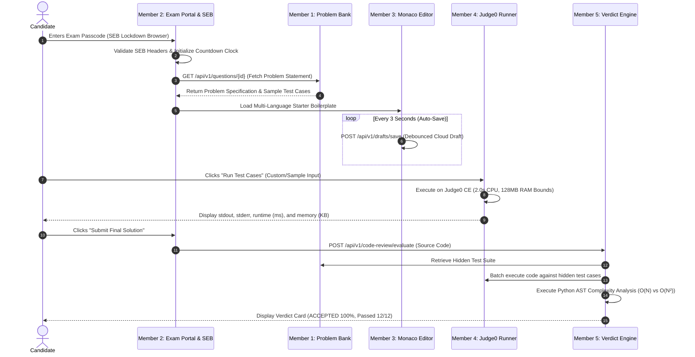
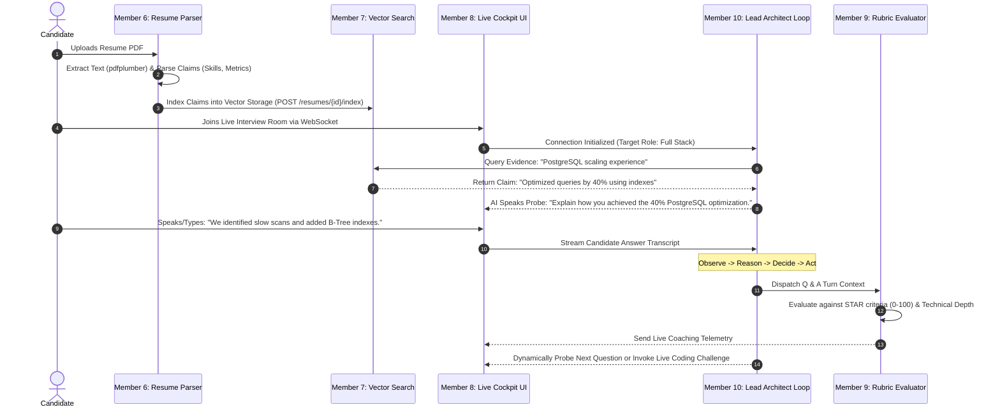

# Project 08: 10-Member Presentation Slide Deck & End-to-End System Flows
**Author:** Prajeeth (Team Lead & Lead Architect)  
**System:** Project 08 (AI Mock Interview & Assessment Platform)  
**Target Milestone:** Version 1.0 (End-of-Week 1 Release & Mentor Viva Defense)  
**Audience Level:** 2nd-Year Engineering Students (Beginner Friendly, Chatbot/Agent Assisted)  

---

## 🧭 Strategic Architecture Roadmap: Why Backend-First for Version 1

> [!IMPORTANT]
> ### 🏆 The Engineering Verdict: **Backend-First (API & Contract Driven) for Version 1**
> For a team of 10 engineering students (mostly 2nd-years building their first large system), attempting to build React state, Tailwind layouts, Monaco DOM instances, and WebSockets simultaneously with backend business logic is the #1 cause of project failure and integration deadlocks.

### Why We Are Executing Backend-First:
1. **Interactive Testing via Swagger UI (`/docs`):**  
   FastAPI automatically generates an interactive dashboard at `http://localhost:8000/docs`. Every student can test their API by clicking **"Try it out"**, entering sample JSON, and seeing instant HTTP 200 responses with zero frontend code required!
2. **Confidence via Automated Testing (`pytest`):**  
   Every teammate has an automated test suite (`pytest backend/tests/test_<module>.py -v`). If it passes green, their feature is 100% functionally correct and ready for viva demonstration.
3. **Frontend Scaffold is Pre-Built:**  
   All 10 UI components already exist in `frontend/components/team_a/` and `frontend/components/team_b/`. Once the backend endpoints are verified, connecting the UI is as simple as calling `fetch()`.
4. **V1 Focus vs. Future Polish:**  
   For Version 1, our mentor wants to see that **the engine actually works** (Safe Exam Browser locks the session, Judge0 executes code, resume claims are extracted, and the AI agent probes answers). UI animations, micro-interactions, sound effects, and themes can easily be refined in Version 2.

---

## 🌊 Master End-to-End System Flows (Version 1)

### Flow 1: Module 1 — Formal Coding Track Lifecycle


---

### Flow 2: Module 2 — AI Live Interview & Probing Lifecycle


---

## 📽️ The 10-Member PPT Slide Deck (1 Slide per Member)

Each member can copy their assigned slide directly into Google Slides or PowerPoint.

---

### 💻 Slide 1: Member 1 — Problem Blueprints & Testcase Bank
* **Branch:** `feat/fc-problem-blueprints`
* **Assigned Files:**
  * Frontend: `frontend/components/team_b/QuestionBank.tsx`
  * Backend API: `backend/api/questions.py`
  * Database Model: `backend/models/blueprint.py`
  * Automated Tests: `backend/tests/test_questions.py`

#### 1. What This Feature Does (Real-World Intuition)
"Think of LeetCode or HackerRank: before any student can write code, the system must have a library of coding questions with descriptions, starter code, sample test cases for practice, and secret hidden test cases to grade exams fairly."

#### 2. The 3-Step Execution Flow
```
[Admin/System Input] ──> [FastAPI Question Router] ──> [Database & Candidate Output]
(Title, Difficulty,       (Validates Constraints,       (Stores in SQLite/PostgreSQL,
 Sample & Hidden I/O)      Masks Hidden Test Cases)      Serves GET /questions to Candidate)
```

#### 3. What I Built & Demo for Version 1
1. `GET /api/v1/questions` returning a list of coding problems filtered by difficulty (`Easy`, `Medium`, `Hard`).
2. `GET /api/v1/questions/{id}` returning problem statement, constraints, and visible sample test cases.
3. Strict security masking: Hidden test cases are never exposed in public endpoints.
4. Filterable question catalog UI with difficulty tags and starter boilerplate code.

#### 4. Viva Question & 10-Second Winning Answer
* **Q:** *Why do you separate sample test cases from hidden test cases?*
* **A:** *"Sample test cases are given to the candidate to test their logic locally. Hidden test cases test edge cases (large inputs, null values, time limits) and must remain hidden on the server to prevent candidates from hardcoding output values."*

---

### 💻 Slide 2: Member 2 — Candidate Exam Portal & SEB Lockdown
* **Branch:** `feat/fc-exam-portal-seb`
* **Assigned Files:**
  * Frontend: `frontend/components/team_b/ExamPortal.tsx`
  * Backend API: `backend/api/exams.py`
  * Database Model: `backend/models/formal_exam.py`
  * Automated Tests: `backend/tests/test_exams.py`

#### 1. What This Feature Does (Real-World Intuition)
"In university or campus placements, online exams must be secure. My module is the digital security guard: it verifies the student's exam passcode, ensures they are using Safe Exam Browser (SEB), keeps track of the official exam countdown timer, and detects cheating attempts like switching tabs or exiting full screen."

#### 2. The 3-Step Execution Flow
```
[Passcode & Browser Headers] ──> [SEB Security Middleware] ──> [Active Exam Session]
(Candidate Passkey +             (Validates Config Hash,       (Starts Countdown Timer,
 X-SafeExamBrowser Header)        Listens for Tab Switch/Blur)  Logs Proctoring Infractions)
```

#### 3. What I Built & Demo for Version 1
1. `POST /api/v1/exams/start` validating exam passkey and creating an active session token.
2. `POST /api/v1/exams/event` logging security infractions (tab switch, window blur, exit full screen).
3. Fullscreen exam dashboard with a synchronized countdown timer and proctoring warning banner.

#### 4. Viva Question & 10-Second Winning Answer
* **Q:** *How does your system know if a student switches tabs or opens another window?*
* **A:** *"We use browser DOM event listeners (`document.visibilitychange` and `window.onblur`). The moment the exam window loses focus, an event payload is sent to `POST /exams/event`, logging a strike against the candidate's exam record."*

---

### 💻 Slide 3: Member 3 — Multi-Language Monaco Editor & Draft Auto-Save
* **Branch:** `feat/fc-monaco-editor`
* **Assigned Files:**
  * Frontend: `frontend/components/team_a/MonacoEditor.tsx`
  * Backend API: `backend/api/drafts.py`
  * Database Model: `backend/models/draft.py`
  * Automated Tests: `backend/tests/test_drafts.py`

#### 1. What This Feature Does (Real-World Intuition)
"Every developer loves VS Code. My module embeds the exact same VS Code editor (Monaco Editor) directly into our web browser, supporting Python, Java, C++, and JavaScript. Most importantly, it auto-saves code every 3 seconds so students never lose their work if the browser crashes or the internet cuts out."

#### 2. The 3-Step Execution Flow
```
[Candidate Keystrokes] ──> [3-Second Debounce Engine] ──> [Cloud Draft Storage]
(Typing code in            (Collects code buffer,          (Persists to code_drafts table,
 Python/Java/C++/JS)        avoids spamming backend)       Restores code on page refresh)
```

#### 3. What I Built & Demo for Version 1
1. In-browser Monaco editor with dark/light themes and multi-language syntax highlighting.
2. Language selector that automatically injects default starter code templates.
3. 3-second debounced auto-save calling `POST /api/v1/drafts/save`.
4. `GET /api/v1/drafts/latest` that restores the latest code draft when the student refreshes the browser.

#### 4. Viva Question & 10-Second Winning Answer
* **Q:** *What is debouncing and why did you use it for auto-save?*
* **A:** *"Debouncing ensures we do not send an API request on every single keypress. We wait until the candidate stops typing for 3 seconds before sending the draft to the database, reducing server load by over 90%."*

---

### 💻 Slide 4: Member 4 — Judge0 Execution Sandbox & Runner API
* **Branch:** `feat/fc-judge0-sandbox`
* **Assigned Files:**
  * Frontend: `frontend/components/team_a/TestConsole.tsx`
  * Backend API: `backend/api/execution.py`
  * Database Model: `backend/models/submission.py`
  * Automated Tests: `backend/tests/test_execution.py`

#### 1. What This Feature Does (Real-World Intuition)
"Running user-submitted code directly on our web server is dangerous—someone could submit infinite loops or malicious scripts. My module sends the candidate's code to an isolated sandbox (Judge0 CE), enforces a 2.0-second CPU limit and 128MB RAM limit, and displays stdout/stderr output in a terminal console."

#### 2. The 3-Step Execution Flow
```
[Source Code + Stdin] ──> [Judge0 CE Sandbox Engine] ──> [Terminal Test Console]
(Candidate's Python/Java    (Enforces 2.0s CPU bound,     (Displays stdout, stderr,
 code + custom test input)   128MB RAM limit in Docker)    runtime in ms, memory in KB)
```

#### 3. What I Built & Demo for Version 1
1. `POST /api/v1/execution/run` dispatching code and custom stdin to Judge0 CE asynchronously.
2. `GET /api/v1/execution/status/{token}` polling execution state with backoff until completed.
3. Terminal console UI displaying stdout, compilation errors, execution time in milliseconds, and memory used.
4. Protection against infinite loops via 2.0s hard execution cutoff.

#### 4. Viva Question & 10-Second Winning Answer
* **Q:** *What happens if a student writes an infinite loop like `while True: pass`?*
* **A:** *"Our execution API sets a `cpu_time_limit: 2.0`. If execution exceeds 2 seconds, Judge0 terminates the process and returns a Time Limit Exceeded (`TLE`) status without crashing our platform."*

---

### 💻 Slide 5: Member 5 — Verdict Engine & Static AST Code Review
* **Branch:** `feat/fc-verdict-engine`
* **Assigned Files:**
  * Frontend: `frontend/components/team_a/CodeReviewCard.tsx`
  * Backend API: `backend/api/code_review.py`
  * Database Model: `backend/models/review.py`
  * Automated Tests: `backend/tests/test_code_review.py`

#### 1. What This Feature Does (Real-World Intuition)
"When a student clicks 'Submit Exam', my module grades their solution. It runs their code against all hidden test cases to assign a verdict (`ACCEPTED` or `WRONG ANSWER`), calculates their percentage score, and uses Python Abstract Syntax Tree (AST) analysis to check code quality and estimate time complexity."

#### 2. The 3-Step Execution Flow
```
[Final Submitted Code] ──> [Batch Grader + Python AST] ──> [Candidate Scorecard Card]
(Full source code from     (Runs against all hidden test   (ACCEPTED badge, 100% score,
 Monaco Editor)             cases + computes loop depth)    O(N) complexity feedback)
```

#### 3. What I Built & Demo for Version 1
1. `POST /api/v1/code-review/evaluate` batch grading code across all hidden test cases.
2. Standard verdict calculation: `ACCEPTED` (all passed), `WRONG_ANSWER` (partial), `TIME_LIMIT_EXCEEDED`, `COMPILATION_ERROR`.
3. Python AST analyzer extracting cyclomatic complexity, nested loop depth, and clean code suggestions.
4. Submission summary card showing pass/fail ratios and code quality metrics.

#### 4. Viva Question & 10-Second Winning Answer
* **Q:** *How does your AST static analysis detect nested loops without running the code?*
* **A:** *"Python's `ast` module parses the code into a syntax tree. We traverse the tree using a NodeVisitor to detect `ast.For` or `ast.While` nodes nested inside each other, indicating $O(N^2)$ or higher time complexity."*

---

### 🤖 Slide 6: Member 6 — Resume PDF Ingestion & Claim Extraction
* **Branch:** `feat/ai-resume-claim-parser`
* **Assigned Files:**
  * Frontend: `frontend/components/team_b/ResumeViewer.tsx`
  * Backend API: `backend/api/resumes.py`
  * Database Model: `backend/models/resume_claim.py`
  * Automated Tests: `backend/tests/test_resumes.py`

#### 1. What This Feature Does (Real-World Intuition)
"In a real interview, the interviewer reads your resume and asks questions based on your projects and skills. My module parses uploaded PDF resumes, extracts clean text, and structures candidate claims into JSON format (skills, work history, projects, metrics) so the AI interviewer knows what to ask."

#### 2. The 3-Step Execution Flow
```
[Candidate PDF Resume] ──> [PDF Extraction Pipeline] ──> [Structured Claim Schema]
(Uploaded via multipart    (Uses pdfplumber/pypdf to      (JSON: Skills list, Projects,
 form-data dropzone)        clean text & extract claims)   Metrics, Unverified Flags)
```

#### 3. What I Built & Demo for Version 1
1. `POST /api/v1/resumes/upload` accepting multipart PDF files and extracting text.
2. `GET /api/v1/resumes/{id}/claims` returning structured claims divided into skills, experiences, and metrics.
3. Drag-and-drop resume upload dropzone in Next.js.
4. Interactive resume viewer displaying parsed skill chips and detected project cards.

#### 4. Viva Question & 10-Second Winning Answer
* **Q:** *Why do we structure resume text into JSON claims instead of using raw text?*
* **A:** *"Raw text contains formatting noise and headers. Structuring claims into JSON (skills, experience, metrics) allows our AI interviewer to query specific claims directly, such as 'Verify PostgreSQL project experience'."*

---

### 🤖 Slide 7: Member 7 — Semantic Chunking & RAG Retrieval API
* **Branch:** `feat/ai-resume-rag-retrieval`
* **Assigned Files:**
  * Frontend: `frontend/components/team_b/AuthModal.tsx`
  * Backend API: `backend/api/auth.py`
  * Database Model: `backend/models/user.py`
  * Automated Tests: `backend/tests/test_auth.py`

#### 1. What This Feature Does (Real-World Intuition)
"LLMs have limited context and can hallucinate. Retrieval-Augmented Generation (RAG) solves this: my module breaks the candidate's parsed resume into semantic chunks, generates vector embeddings, and provides a semantic search API so the AI interviewer can retrieve exact resume facts in milliseconds."

#### 2. The 3-Step Execution Flow
```
[Parsed Resume Claims] ──> [Chunking & Embedding Engine] ──> [Top-K Semantic Search]
(Structured text from      (Splits text into 200-word        (Returns top-3 matching
 Member 6)                  chunks & vector embeddings)       passages with similarity scores)
```

#### 3. What I Built & Demo for Version 1
1. `POST /api/v1/resumes/{id}/index` chunking resume text and indexing embeddings into vector storage.
2. `GET /api/v1/resumes/{id}/query?q=...` retrieving top-k relevant resume passages under 200ms.
3. Candidate authentication endpoints (`POST /auth/register`, `POST /auth/login`).
4. Candidate profile hub displaying resume knowledge indexing readiness.

#### 4. Viva Question & 10-Second Winning Answer
* **Q:** *What is cosine similarity and how is it used in RAG?*
* **A:** *"Cosine similarity measures the angle between two embedding vectors. When the AI searches for 'database experience', we compute the cosine similarity between the query vector and resume chunk vectors to retrieve the most relevant evidence."*

---

### 🤖 Slide 8: Member 8 — Live Interview Cockpit UI & WebSocket Client
* **Branch:** `feat/ai-interview-cockpit`
* **Assigned Files:**
  * Frontend: `frontend/components/team_a/LiveCockpit.tsx`
  * Backend API: `backend/api/sessions.py`
  * Database Model: `backend/models/session.py`
  * Automated Tests: `backend/tests/test_sessions.py`

#### 1. What This Feature Does (Real-World Intuition)
"This is the virtual interview room. My module provides a sleek, modern video call interface where candidates see their webcam feed, an animated audio waveform visualizer, a live auto-scrolling conversation transcript, and real-time alerts when the AI switches to a coding or system design challenge."

#### 2. The 3-Step Execution Flow
```
[User Mic & Camera] ──> [Bidirectional WebSocket Client] ──> [Live Interview Room]
(Audio stream toggle,   (Low-latency full-duplex           (Live transcript stream,
 candidate webcam tile)  communication on /sessions/ws)     Interactive action banners)
```

#### 3. What I Built & Demo for Version 1
1. `WS /api/v1/sessions/ws/{session_id}` handling real-time chat turns with ping/pong keepalives.
2. `POST /api/v1/sessions/start` & `POST /api/v1/sessions/end` controlling interview session lifecycle.
3. Responsive interview room UI with audio controls (Mute, Unmute) and AI speaking indicators.
4. Dynamic action prompt card (e.g. 'Interviewer has triggered a live coding challenge').

#### 4. Viva Question & 10-Second Winning Answer
* **Q:** *Why do you use WebSockets instead of normal HTTP REST for the interview room?*
* **A:** *"REST requires continuous client polling, creating latency and server overhead. WebSockets establish a persistent, bidirectional connection, allowing the AI to stream questions and audio chunks with sub-100ms latency."*

---

### 🤖 Slide 9: Member 9 — Turn-by-Turn Rubric Scoring & Scorecard Analytics
* **Branch:** `feat/ai-rubric-evaluator`
* **Assigned Files:**
  * Frontend: `frontend/components/team_b/ScorecardView.tsx`
  * Backend API: `backend/api/evaluations.py`
  * Database Model: `backend/models/rubric.py`
  * Automated Tests: `backend/tests/test_evaluations.py`

#### 1. What This Feature Does (Real-World Intuition)
"An interview is useless without constructive feedback. My module evaluates candidate answers turn-by-turn using the industry-standard STAR framework (Situation, Task, Action, Result), calculates grades across 4 dimensions, and renders a publication-grade scorecard with radar charts and a 30-day prep roadmap."

#### 2. The 3-Step Execution Flow
```
[Candidate Q&A Turn] ──> [STAR & Depth Evaluation Engine] ──> [Executive Scorecard]
(Question asked +        (Grades Situation, Task, Action,    (Radar chart, Overall score,
 candidate response)      Result on 0-100 scale)              30-day preparation roadmap)
```

#### 3. What I Built & Demo for Version 1
1. `POST /api/v1/evaluations/turn` scoring each turn on STAR criteria and technical accuracy.
2. `GET /api/v1/evaluations/{session_id}/summary` generating candidate performance percentiles.
3. Interactive candidate scorecard UI with circular score gauge and category radar breakdown.
4. Personalized preparation roadmap suggesting specific topics to revise over 30 days.

#### 4. Viva Question & 10-Second Winning Answer
* **Q:** *What is the STAR framework used in your rubric evaluation?*
* **A:** *"STAR stands for Situation, Task, Action, and Result. It is the gold-standard behavioral and technical interview technique used by top tech companies to evaluate if candidates clearly articulate their direct impact."*

---

### 🧠 Slide 10: Member 10 / Lead Architect (Prajeeth) — Master Stateful Agent Loop
* **Branch:** `feat/ai-agent-core` & `develop`
* **Assigned Files:**
  * Frontend: `frontend/app/page.tsx` & Root Layout
  * Backend Entrypoint: `backend/main.py` & `backend/api/probing.py`
  * Database Model: `backend/models/agent_turn.py`
  * Integration Tests: `backend/tests/test_probing.py` & Complete Test Suite

#### 1. What This Feature Does (Real-World Intuition)
"This is the central nervous system of Project 08. Rather than asking rigid, pre-scripted questions, my stateful agent loop observes what the candidate says, cross-references their claimed resume facts via RAG, reasons about their technical depth, and dynamically decides whether to probe deeper, challenge them, or switch to a live coding round."

#### 2. The 3-Step Execution Flow
```
[Candidate Response + Resume RAG Context]
               │
               ▼
[Observe ──> Reason ──> Decide ──> Act]  (Stateful Agent Cycle)
               │
               ▼
[Streamed AI Question OR Dynamic Coding Tool Invocation]
```

#### 3. What I Built & Demo for Version 1
1. Stateful **Observe -> Reason -> Decide -> Act** agent state machine.
2. Central WebSocket router coordinating Member 8's UI with Member 7's RAG and Member 9's rubric scoring.
3. Dynamic tool invocation: Automatically triggering Member 3's Monaco Editor mid-interview when verbal answers lack technical substantiation.
4. Central integration across all 10 feature branches into `develop` with 100% passing tests.

#### 4. Viva Question & 10-Second Winning Answer
* **Q:** *How is your agent different from a generic ChatGPT prompt?*
* **A:** *"ChatGPT is stateless and reactive. Our platform runs a stateful agent loop with explicit phase transitions (Behavioral -> Architecture -> Coding), grounded in candidate resume RAG context, capable of dynamically triggering interactive coding environments mid-conversation."*

---

## 📋 Summary Table for Quick Reference

| Slide | Member / Role | Module | Assigned Branch | Primary Deliverable |
|---|---|---|---|---|
| **1** | Problem Blueprints | Formal Coding | `feat/fc-problem-blueprints` | Problem CRUD, Sample I/O, Hidden Testcases |
| **2** | SEB Exam Portal | Formal Coding | `feat/fc-exam-portal-seb` | Passcode Auth, SEB Headers, Countdown Timer |
| **3** | Monaco Editor | Formal Coding | `feat/fc-monaco-editor` | In-Browser IDE, Boilerplates, 3s Auto-Save |
| **4** | Judge0 Sandbox | Formal Coding | `feat/fc-judge0-sandbox` | Sandbox Execution, 2s Timeout, Test Console |
| **5** | Verdict Engine | Formal Coding | `feat/fc-verdict-engine` | Hidden Suite Grading, AST Analysis, Scorecard |
| **6** | Resume Parser | AI Interview (RAG) | `feat/ai-resume-claim-parser` | Multipart PDF Upload, Claim JSON Schema |
| **7** | RAG Vector Engine | AI Interview (RAG) | `feat/ai-resume-rag-retrieval` | Chunking, Vector Embeddings, Top-K Query API |
| **8** | Interview Cockpit | AI Interview (Agent) | `feat/ai-interview-cockpit` | Live Room UI, Audio Visualizer, WebSocket Stream |
| **9** | Rubric Evaluator | AI Interview (Agent) | `feat/ai-rubric-evaluator` | STAR Rubric, Scorecard, 30-Day Prep Roadmap |
| **10**| **Lead Architect** | AI Interview (Agent) | `feat/ai-agent-core` | Stateful Agent Loop, Dynamic Tool Dispatching |
